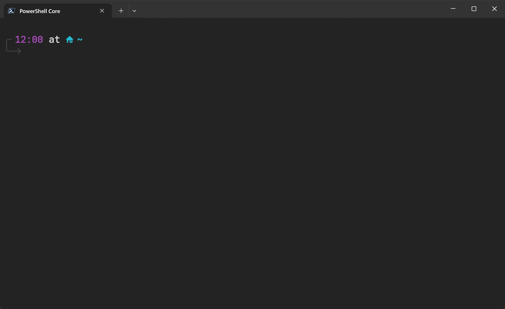

<h1 align="center">
  <a href="https://pnp.github.io/cli-microsoft365">
    
  </a>
  <br>CLI for Microsoft 365<br>
</h1>

<h4 align="center">
  One CLI for Microsoft 365
</h4>

<p align="center">
  <a href="https://app.circleci.com/pipelines/github/pnp/cli-microsoft365">
    
  </a>
  
  <a href="https://coveralls.io/github/pnp/cli-microsoft365?branch=master">
    
  </a>

  <a href="https://twitter.com/climicrosoft365">
    
  </a>
</p>

<p align="center">
  <a href="https://www.npmjs.com/package/@pnp/cli-microsoft365">
    
  </a>
  
  <a href="https://www.npmjs.com/package/@pnp/cli-microsoft365">
    
  </a>
</p>

<p align="center">CLI for Microsoft 365 helps you manage your Microsoft 365 tenant and SharePoint Framework projects.</p>

<p align="center">
  <a href="https://pnp.github.io/cli-microsoft365">Website</a> | 
  <a href="#features">Features</a> |
  <a href="#install">Install</a> | 
  <a href="#usage">Usage</a> | 
  <a href="#build">Build</a> | 
  <a href="#contribute">Contribute</a>
</p>
<p align="center">
  <a href="#sharing-is-caring">Sharing is Caring</a> |
  <a href="#code-of-conduct">Code of Conduct</a> | 
  <a href="#disclaimer">Disclaimer</a>
</p>

<p align="center">
  
</p>

## Features

- Run on any OS
  - Linux
  - MacOS
  - Windows
- Run on any shell
  - Azure Cloud Shell
  - bash
  - cmder
  - PowerShell
  - zsh
- Unified login
  - Access all your Microsoft 365 workloads
- Supported workloads
  - Azure Active Directory
  - Microsoft Teams
  - Microsoft To Do
  - OneDrive
  - Outlook
  - Planner
  - Power Automate
  - Power Apps
  - Skype for Business
  - SharePoint Online
  - Yammer
- Supported authentication methods
  - Azure Managed Identity
  - Certificate
  - Device Code
  - Username and Password
- Manage your SharePoint Framework projects
  - Uprade your projects
  - Check your environment compatibility

> Follow our [Twitter](https://twitter.com/climicrosoft365) account to keep yourself updated about new features, improvements, and bug fixes.

## Install

To install this CLI, you will need [`node`](https://nodejs.org) `>= 8.0.0` installed.

```
npm install -g @pnp/cli-microsoft365
```

<details>
  <summary>Install beta version  β</summary>

  ```
  npm install -g @pnp/cli-microsoft365@next
  ```
</details>

<details>
  <summary>Alternate package managers 🧶</summary>

  ### yarn

  ```
  yarn global add @pnp/cli-microsoft365
  ```

  ### npx

  ```
  npx @pnp/cli-microsoft365
  ```
</details>

<details>
  <summary>Run CLI for Microsoft 365 in a Docker container 🐳</summary>

  ```
  docker run --rm -it m365pnp/cli-microsoft365:latest
  ```

  Checkout our [guide](https://pnp.github.io/cli-microsoft365/user-guide/run-cli-in-docker-container/) to learn more about how to run CLI for Microsoft 365 using Docker
</details>

## Usage

Use the `login` command to start the Device Code login flow to authenticate with your Microsoft 365 tenant. 

```sh
m365 login
```

>On your first login you will be asked to consent to several permissions that the `PnP Management Shell` multi-tenant app requires for the commands to work successfully against your tenant. If you want to create your own identity to use with the CLI, refer to the [Using your own Azure AD Identity](https://pnp.github.io/cli-microsoft365/user-guide/using-own-identity/) guide.

>For alternative authentication methods and usage, refer to the [login](https://pnp.github.io/cli-microsoft365/cmd/login/) command documentation

List all commands using the global `--help` option.

```sh
m365 --help
```

Get command information and example usage using the global `--help` option.

```sh
m365 spo site get --help
```

Execute a command and output response as text.

```sh
m365 spo site get --webUrl https://contoso.sharepoint.com
```

Execute a command and output response as JSON using the global `--output` option.

```sh
m365 spo site get --webUrl https://contoso.sharepoint.com --output json
```

Filter responses and return custom objects using [JMESPath](https://jmespath.org/) queries using the global `--query`  option.

```sh
m365 spo site list --output json --query '[?Template==`GROUP#0`].{Title:Title, Url:Url}'
```

> For more examples and usage, refer to the [command](https://pnp.github.io/cli-microsoft365/cmd/login/) and  [sample scripts](https://pnp.github.io/cli-microsoft365/sample-scripts/) documentation.

## Build

To build and run this CLI locally, you will need [`node`](https://nodejs.org) `>= 14.0.0` installed.

```sh
# Clone this repository
$ git clone https://github.com/pnp/cli-microsoft365

# Go into the repository
$ cd cli-microsoft365

# Install dependencies
$ npm install

# Build the CLI
$ npm run build

# Symlink your local CLI build
$ npm link
```

When you execute any `m365` command from the terminal, it will now use your local clone of the CLI.

## Contribute

We love to accept contributions.

If you want to get involved with helping us grow the CLI, whether that is suggesting or adding a new command, extending an existing command or updating our documentation, we would love to hear from you.

Checkout our [Wiki](https://github.com/pnp/cli-microsoft365/wiki) for guides on how to contribute to this project.

## Sharing is Caring

This project is associated with the [Microsoft 365 Patterns and Practices](https://pnp.github.io) (PnP) organisation, which is a virtual team consisting of Microsoft employees and community members focused on helping the community make the best use of Microsoft products.

## Code of Conduct

This project has adopted the [Microsoft Open Source Code of Conduct](https://opensource.microsoft.com/codeofconduct/). 

For more information see the [Code of Conduct FAQ](https://opensource.microsoft.com/codeofconduct/faq/) or contact [opencode@microsoft.com](mailto:opencode@microsoft.com) with any additional questions or comments.

## Disclaimer

**THIS CODE IS PROVIDED *AS IS* WITHOUT WARRANTY OF ANY KIND, EITHER EXPRESS OR IMPLIED, INCLUDING ANY IMPLIED WARRANTIES OF FITNESS FOR A PARTICULAR PURPOSE, MERCHANTABILITY, OR NON-INFRINGEMENT.**


