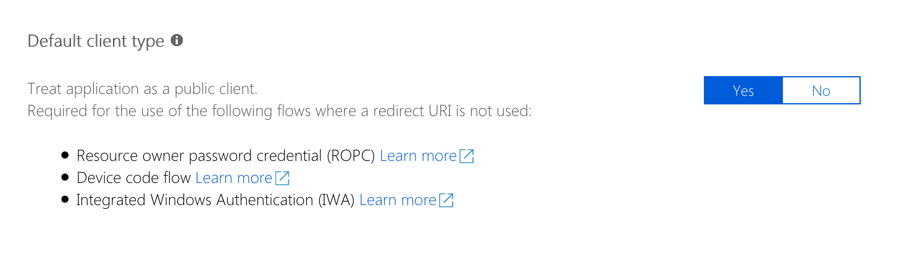

# Authorization and access tokens

Commands provided with the CLI for Microsoft 365 manipulate different settings of Microsoft 365. Before you can execute any of the commands in the CLI, you have to log in to Microsoft 365. CLI for Microsoft 365 will then automatically retrieve the access token necessary to execute the particular command.

## Authorization in the CLI for Microsoft 365

There are a number of ways in which you can authenticate and authorize with Microsoft 365. The CLI for Microsoft 365 uses the OAuth protocol to authorize with Microsoft 365 and its services. OAuth flows in Microsoft 365 are facilitated by Azure Active Directory.

### Azure AD application used by the CLI for Microsoft 365

CLI for Microsoft 365 gets access to Microsoft 365 through a custom Azure AD application named _PnP Microsoft 365 Management Shell_. If you don't want to consent this application in your tenant, you can use a different application instead.

!!! important
    When you decide to use your own Azure AD application, you need to choose the application to be a **public client**. Despite the setting's description, the application will not be publicly accessible. This setting enables the use of the device flow for your own application. Without activating this setting, it is not possible to complete the authentication process. The option is currently only available in the preview blade for managing for Azure AD applications.
    

When specifying a custom Azure AD application to be used by the CLI for Microsoft 365, set the `CLIMICROSOFT365_AADAPPID` environment variable to the ID of your Azure AD application.

CLI for Microsoft 365 requires the following permissions to Microsoft 365 services:

- Microsoft 365 SharePoint Online
  - Have full control of all site collections
  - Read user profiles
  - Read and write managed metadata
- Microsoft Graph
  - Invite guest users to the organization
  - Read and write all groups
  - Read and write directory data
  - Access directory as the signed in user
  - Read and write identity providers
  - Send mail as a user
  - Read and write to all app catalogs
- Microsoft 365 Management APIs
  - Read service health information for your organization
- Windows Azure Active Directory
  - Access the directory as the signed-in user
- Windows Azure Service Management API
  - Access Azure Service Management as organization users
- Yammer
  - Read and write to the Yammer platform

!!! attention
    After changing the ID of the Azure AD application used by the CLI for Microsoft 365 refresh the existing connection to Microsoft 365 using the `login` command. If you try to use the existing connection, CLI for Microsoft 365 will fail when trying to refresh the existing access token.

### Access and refresh tokens in the CLI for Microsoft 365

After completing the OAuth flow, the CLI receives from Azure Active Directory a refresh- and an access token. Each web request to Microsoft 365 APIs contains the access token which authorizes the CLI for Microsoft 365 to execute the particular operation. When the access token expires, the CLI uses the refresh token to obtain a new access token. When the refresh token expires, the user has to reauthenticate to Microsoft 365 to obtain a new refresh token.

## Services and commands

Each command in the CLI for Microsoft 365 belongs to a service, for example the [spo site add](../cmd/spo/site/site-add.md) command, which creates a new modern site, belongs to the SharePoint Online service, while the [aad sp get](../cmd/aad/sp/sp-get.md) command, which lists Azure Active Directory service principals, belongs to the Azure Active Directory Graph service. Each service in Microsoft 365 is a different Azure Active Directory authorization resource and requires a separate access token. When working with the CLI, you can be simultaneously connected to multiple services. Each command in the CLI knows which Microsoft 365 service it communicates with and for which resource it should have a valid access token.

## Communicating with Microsoft 365

Before a command can log in to Microsoft 365, it requires a valid access token. CLI for Microsoft 365 automatically obtains the access token for the particular web request without you having to worry about it.

## Yammer commands are executed in the context of the current logged in user

Yammer commands require the delegated 'user_impersonation' permission to be granted for the Azure AD application. Yammer commands are executed in the context of the currently logged in user. Certificate-based authentication with app_only permissions is currently not supported by Azure AD.
