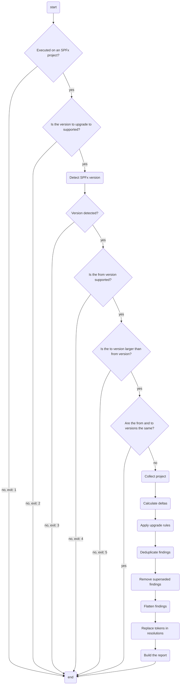

# How it works: spfx project upgrade

## Purpose

The `spfx project upgrade` command simplifies the process of upgrading SharePoint Framework projects to newer versions of SPFx. While upgrading an SPFx project seems as simple as increasing the versions of the core packages to the desired versions, in practice, it's more nuanced and involves additional steps.

The `spfx project upgrade` command produces a list of steps needed to upgrade a SharePoint Framework project from one version to another to ensure that your project has everything that a newly created project would have.

## Concepts

Following concepts are fundamental for understanding how the `spfx project upgrade` command works.

### Supported SPFx version

Upgrading SPFx projects from one version to another often requires more changes than just upgrading core SPFx packages. When a new SPFx version is released, we analyze the changes between the latest and the previous version of SPFx and describe them using a **version delta**. To let our users know that we support upgrading SPFx projects to that version, we add it to the array of supported versions in the `src/m365/spfx/commands/project/project-upgrade.ts` file.

Supported versions are ordered in chronological order in which they were released. This is important, because it determines the order in which rules should be applied when upgrading SPFx projects across multiple versions.

### Version delta

The `spfx project upgrade` command uses version deltas to describe changes between SPFx versions. Each delta describes changes between two versions: the version to upgrade to and the previous version, for example: the `upgrade-1.17.4.ts` delta describes only what's changed between SPFx versions 1.17.3 and 1.17.4.

Breaking down deltas to just two SPFx versions allows users to upgrade their projects in any supported SPFx range, e.g. 1.4.1 to 1.16.0 or 1.14.0 to the latest SPFx version supported by the `spfx project upgrade` command.

Deltas are stored in `src/m365/spfx/commands/project/project-upgrade` in files following the `upgrade-XXX.ts` naming convention, where `XXX` is the SPFx version to upgrade the project to.

Each delta describes changes between the two versions of SPFx using **rules**.

### Rule

A rule represents an atomic unit of change between one version of SPFx and another. A rule can for example describe a package dependency, a file (if a file was added or removed in a newer version of SPFx), or a specific property in a JSON file.

Each property in a JSON file or dependency in a project is represented by a separate rule. This allows us to remove duplicate rules when upgrading projects through multiple versions.

Each rule stands on its own and, other than defining superseded rules, doesn't have any knowledge of other rules. This is an important design decision that allows us to freely compose version deltas without making any assumptions.

To allow rules to be applied to different versions of SPFx, they can accept parameters, such as a dependency version number, property value, etc.

Rules are stored in `src/m365/spfx/commands/project/project-upgrade/rules`. Each rule has a unique identifier which allows us to quickly identify related rules. A rule identifier is built as follows: `FNXXXYYY`, where:

- `FN` is the fixed prefix for _finding_
- `XXX` is the three digit number of the type of finding, eg. dependency rules are 001, dev dependencies 002, etc.
- `YYY` is the three digit number of the rule in its group

Rules' filenames use the following naming convention: `FNXXXYYY_ZZZ_name`, where:

- `FNXXXYYY` is the rule's identifier
- `ZZZ` is the rule's group abbreviation for easy lookup
- `name` is the rule's name for easy lookup

Across the different versions of SPFx, we've built rules that should cover for the typical changes in projects between SPFx versions. That said, in case there's a need for a new rule, follow the design pattern of other rules and reach out to CLI maintainers to verify your design.

### Superseded rules

A rule can supersede one or more other rules. You define superseded rules, by overriding the `supersedes` getter in the rule and return the array of rule IDs that the rule supersedes, e.g.

```ts
import { FileAddRemoveRule } from "./FileAddRemoveRule";

export class FN015004_FILE_config_tslint_json extends FileAddRemoveRule {
  constructor(add: boolean) {
    super('./config/tslint.json', add);
  }

  get id(): string {
    return 'FN015004';
  }

  get supersedes(): string [] {
    return ['FN008001', 'FN008002', 'FN008003'];
  }
}
```

For example, older versions of SPFx used the `config/tslint.json` file, and there were some changes to its contents across the different versions. But then, in SPFx v1.6.0 the file was removed altogether. So if you were to upgrade an SPFx v1.4.0 project to v1.7.0, changing the contents of the `tslint.json` file would've been unnecessary since the file will be deleted anyway. By superseding the file contents update rules with the file deletion rule, we can simplify the upgrade process.

Superseding allows us to avoid unnecessary upgrade work, when a change in a newer version of SPFx makes a change in an older version of SPFx obsolete (eg. applying changes to a file that's deleted in a newer version of SPFx).

When superseding rules, ensure that there are no circular references which would likely lead to issues.

### Finding

When the `spfx project upgrade` command executes a rule on the project and determines, that the project needs the changes defined by the rule, it reports a finding.

A finding contains the information about the rule that triggered it, the recommended resolution (ie. what users need to do to apply the missing change), how the resolution should be executed (eg. a shell command, JSON modification, etc.), and whether the change is recommended or required.

Additionally, each finding has one or more **finding instances**.

### Finding instance

A finding instance describes the name of the file, and the location in the file where the finding's resolution should be applied.

Typically, each finding has one finding instance, but there are some rules that are related to code changes that need to be applied multiple times, which can lead to a finding having multiple instances.

### Report

When the `spfx project upgrade` command ends its execution, it presents the user with a report. The report contains the list of changes that need to be applied to the project to upgrade it to the desired SPFx version (findings).

The `spfx project upgrade` command offers several types of reports, each optimized for a different scenario:

- **JSON** with structured output, recommended for automated processing
- **plain-text** with basic human-readable output
- **markdown** with rich human-readable output, recommended for most cases
- **CodeTour** for interactive upgrade guidance using the VSCode CodeTour plugin, recommended if you want to learn more about the changes and easily navigate through your project

Report types are supported through command output in the `spfx project upgrade` command.

### Project model

To speed up the upgrade process, the `spfx project upgrade` command starts the upgrade by collecting the relevant project files and building an object model out of them. That way, files need to be parsed only once and rules can be applied on in-memory objects that represent the project. This makes the upgrade process fast, even when it spans multiple versions with many different changes.

Project model is stored in `src/m365/spfx/commands/project/project-model`.

### Exit codes

Shell executables (CLIs, scripts, etc.) communicate to the parent process whether their execution succeeded using exit codes. An exit code of 0 means success and a non-0 exit code means failure. The `spfx project upgrade` command uses exit codes to communicate different error states to the parent process using it. These error codes have been originally designed for use with the PnP Yeoman Generator.

The exit codes of the `spfx project upgrade` command are defined in the `src/m365/spfx/commands/project/project-upgrade.ts` file.

## How it works

This section explains the process that the `spfx project upgrade` command follows to produce steps to upgrade the SPFx project to the specified SPFx version.



### Detecting project version

The `spfx project upgrade` command starts by checking if it's been executed in a folder belonging to an SPFx project.

Once the command locates the SPFx project's root folder, it will try to determine the project's version. It does this by using the following steps:

1. Check for the presence of the `.yo-rc.json` file. If found, get the value of the `@microsoft/generator-sharepoint.version` property. When present, check the value of the `@microsoft/generator-sharepoint.environment` property to adjust the version number for SPFx versions targeting on-prem SharePoint deployments.
1. If `.yo-rc.json` was not found, check for the presence of the `package.json` file. If found, read the version of the `@microsoft/sp-core-library` dependency.

After it determines the project version, the command will verify that it supports the specified version, and the specified version to upgrade the project to is newer than the detected project version.

### Collecting the project to upgrade

Next, the command will parse the project to upgrade and build an object model off of it. It will use this model to detect which changes need to be applied to the project to make it match a newly created SPFx version of the specified version.

### Calculating upgrade deltas

As the next step, the command determines the upgrade deltas: the list of upgrades and rules to upgrade the project from the version the command detected to the version specified by the user (or the latest supported version if the user hasn't specified any version).

For example, a user wants to upgrade their SPFx project from version 1.17.0 to 1.17.4. The `spfx project upgrade` command will load deltas `1.17.1`, `1.17.2`, `1.17.3` and `1.17.4`, and stack their rules in the order they're defined in the delta files, so that rules defined in `1.17.4` are executed as last. This will make them take precedence in the **deduplication stage**.

### Applying upgrade rules

After the command builds the list of rules to upgrade the project to the specified SPFx version, it executes them in the order they're defined in deltas.

The rules gets as input the project model that's been collected earlier, and the array of findings. Using its logic, it decides if the specific part of the project needs to be updated and if so, adds the finding to the findings array. Each finding has one or more instances that describe in which file and location the change should be applied.

### Deduplicating findings

After the command processed all rules, it will then remove duplicate findings. Duplicates happen, when users upgrade a project across multiple versions, and multiple deltas apply the same rule, even with different parameters.

For example, let's say you want to upgrade an SPFx project from version 1.17.0 to 1.17.4. One of the rules that will be applied in the upgrade process is **FN001001_DEP_microsoft_sp_core_library** responsible for upgrading the `@microsoft/sp-core-library` dependency to the correct version of SPFx. Since we're upgrading the project from 1.17.0 to 1.17.4, the rule will be executed 4 times:

- 1.17.0 to 1.17.1
- 1.17.1 to 1.17.2
- 1.17.2 to 1.17.3
- 1.17.3 to 1.17.4

Executing this rule 4 times, will lead to 4 findings, one for each SPFx version.
When upgrading npm dependencies, you don't need to install each version of the npm package. Instead, you can directly install the 1.17.4 version of the package. Because the rule is parametrized, the `spfx project upgrade` command will report 4 findings. Through deduplication, we can significantly simplify the upgrade process, and leave only the latest instance suggesting that you install the 1.17.4 version of the package.

The `spfx project upgrade` command deduplicates findings by comparing their IDs. The finding that was added as last takes precedence over findings added earlier. This is exactly why it's important that SPFx versions are defined in chronological order so that the latest project configuration is preserved in favor of older settings.

Deduplicating findings removes unnecessary steps from the upgrade process that would be overwritten anyway. This not only simplifies but also speeds up the upgrade process.

### Removing superseded findings

The next stage is to find and remove findings that are superseded by other findings. This further simplifies and speeds up the project upgrade process.

The command removes superseded findings by iterating through the list of all reported findings. For each, it checks if it lists any superseded findings, and if it does, looks for their IDs among the reported findings and removes them from the array.

### Flattening findings

Typically, a finding has one occurrence in a project, because it refers to a specific project aspect. However, there are findings that can have multiple occurrences, for example, when they refer to a property in the manifest and the project has multiple components or to a change in a code file and there are multiple matches in the project.

Before the command starts building the report, it flattens the findings, so that each occurrence is reported as a separate finding. This simplifies building the report and prevents unnecessary nesting of report data.

### Replacing tokens in resolutions

The final stage before generating the report is replacing tokens in findings' resolutions. The `spfx project upgrade` command supports different shells and package managers. When a resolution contains a shell command or a package (un)installation command, these commands are tokenized. That way, they can be translated to the shell and package manager used by the user so that they get ready to use code snippets and don't need to manually adjust them to their shell and package manager.

### Building the report

The final stage of the upgrade process is creating the report, which communicates the list of changes that users need to apply to upgrade their project to the specified SPFx version.

The `spfx project upgrade` command supports several report formats and each format uses specific logic to produce the necessary output. For some formats, like text, JSON or Markdown, it prints the output to stdout which allows users to choose if they want to print the report in the terminal or store it in a file on disk by redirecting the output. CodeTour output on the other hand, always leads to creating a .tour file in the project's root directory, so that it can be opened with the VSCode CodeTour extension.

### Communicating errors using exit codes

When the `spfx project upgrade` command was added to the PnP Yeoman generator, we introduced error codes. These error codes allow us to communicate to the generator (or any other parent process) the result of running the command.

When the command succeeds, it produces the upgrade report and exits with a 0 (success) exit code. It can however, fail for several reasons, ranging from being unable to detect the project to the project using a version that the command doesn't support. Communicating failures using different exit codes allows the parent process to understand what went wrong and either automatically recover or show the user a relevant error message.

## Limitations

While the `spfx project upgrade` command significantly simplifies upgrading SPFx projects, it has some limitations.

### Working directory must be one of the folders of the SPFx project to upgrade

The `spfx project upgrade` command assumes that the current working directory, is one of the directories of the SPFx project to upgrade. It determines that by looking for the `package.json` file. If it doesn't find it, it will keep moving up the directory hierarchy until it reaches the root directory.

### Upgrade logic is based on default project scaffold

When defining deltas, we assume the shape of a newly created SPFx project. By comparing newly created projects from two concurrent SPFx versions, we compare the differences and define the delta. This approach means, that the `spfx project upgrade` command won't consider upgrading any custom files that you might've added to the project or any changes that aren't a part of the default scaffold, and which could have an impact on upgrading the project to the desired SPFx version.

### Findings need to be applied manually

Automatically changing code is complex and error-prone. Because of how intrusive it is, for it to be user-friendly, it requires support for previewing changes before applying them and the ability to undo them in case something went wrong.

While many developers, who build on SPFx, use a source control system like Git, we didn't want to assume it, and depend on it to be our comparison and backup mechanism.

Because of these complexities, we decided that we'll provide an upgrade report, including ready to use commands to apply the necessary changes, but will leave it to users to apply them.

### Rules are run against the collected project

When upgrading an SPFx project, the `spfx project upgrade` command collects the project and builds an object out of it. Then, it executes all rules on the generated object to detect changes necessary to upgrade the project to the specified SPFx version. Combined with the fact, that the `spfx project upgrade` command doesn't automatically apply the necessary changes, it leads to the biggest limitation of the command.

The `spfx project upgrade` command runs each rule on the project as it was collected. When users upgrade an SPFx project across multiple SPFx versions, it's possible, that one SPFx version in the chain requires a change in the project, that the next SPFx version in the chain assumes is there. One example of this are changes to the `.eslintrc.json` file between SPFx v1.14.0 and 1.16.0, where the file was added in v1.15.0 and subsequent versions assume that the file is there and skip their execution when it's missing.

Because changes aren't applied to the project, upgrading projects across multiple SPFx versions leads to errors on rare occasions, where some of the necessary changes are missing from the project.

We could solve this either by introducing an in-memory file system, similar to what Yeoman does, or applying changes directly to the files on disk, keeping in mind that it's critical that we back up the project to allow reverting any changes that we've done. Both solutions are not trivial to implement correctly, which is why we haven't prioritized them yet.
