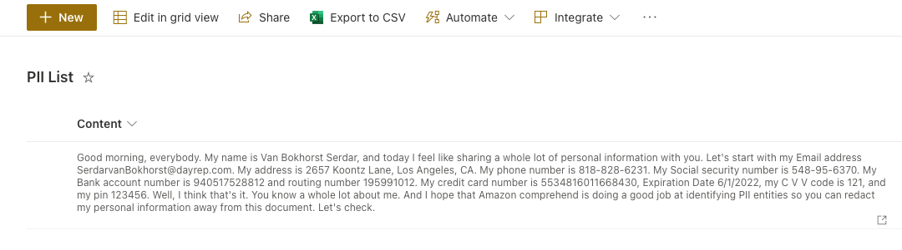
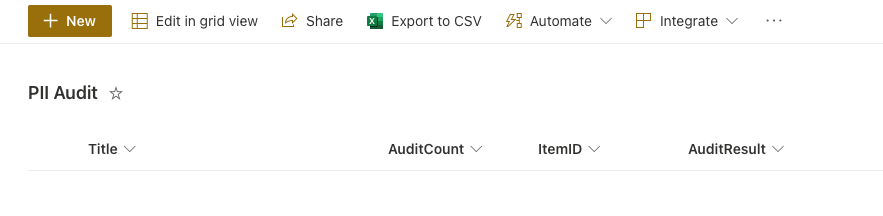
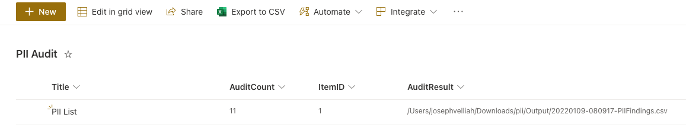
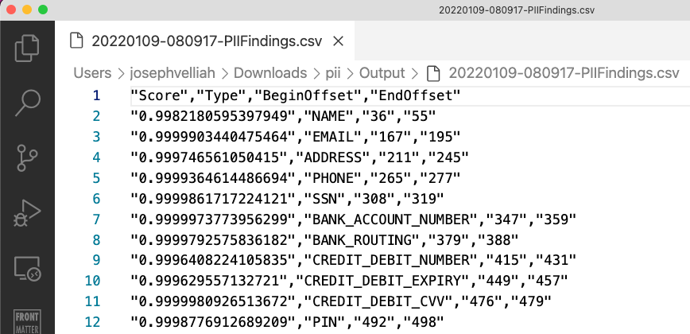

# Detecting PII exists in SharePoint List using AWS Comprehend

Author: [Joseph Velliah](https://blog.josephvelliah.com/detecting-pii-exist-in-sharepoint-list-using-aws-comprehend)

Personally Identifiable Information (PII) is information that, when used alone or with other relevant data, can identify an individual. Sensitive personally identifiable information can include full name, SSN, driver’s license, financial information and medical records. As PII can be used to identify an individual, signify a major threat to companies. If breached, this information can lead to lawsuits and can damage company’s trustworthiness.

[Amazon Comprehend](https://aws.amazon.com/comprehend/) is a natural-language processing (NLP) service that uses machine learning to uncover valuable insights and connections in text and documents. We can now use Amazon Comprehend to protect and control who has access to sensitive data by identifying and redacting Personally Identifiable Information (PII) from text and documents.

Also, we can redact documents(stored in an Amazon S3 bucket) by using Amazon Comprehend asynchronous analysis job. We can choose redaction mode Replace to mask PII entity with character and replace the characters in PII entities with a symbol(!, #, $, %, &, \*, or @). Asynchronous PII redaction batch processing will be a great use case for SharePoint Document Libraries.

In this post, I showcased using Amazon Comprehend to detect PII entities from a specific SharePoint List column and record the results in another list and CSV report via the AWS CLI and CLI for Microsoft 365. Take a look at this script, give it a try, and please send me your feedback via the contact page.

Thank you, [Sriharsha M S](https://aws.amazon.com/blogs/machine-learning/detecting-and-redacting-pii-using-amazon-comprehend/), for your valuable article on this topic.

Prerequisites:

- [CLI for Microsoft 365](https://pnp.github.io/cli-microsoft365/)
- [AWS CLI](https://aws.amazon.com/cli/)
- SharePoint Online Lists(as shown in screenshots)
  - PII List: Items containing dummy/real PII data
  - PII Audit: To store the PII Audit audit detials
- Necessary permission to access SharePoint Lists, Amazon Comprehend, and to write CSV files in local machine via

Source & Target Lists:

[](../../images/sample-scripts/detecting-pii-exists-in-splist-column/pii-source-list.png)

[](../../images/sample-scripts/detecting-pii-exists-in-splist-column/pii-audit-report-list-schema.png)

=== "PowerShell"

    ```powershell
    $spolHostName = "https://tenant-name.sharepoint.com"
    $spolSiteRelativeUrl = "/sites/site-name"
    $spolListToAuditTitle = "PII List"
    $spolListToSaveAuditResponse = "PII Audit"
    $spolListFields = "ID,Title,Content"
    $resultDir = "Output"
    $executionDir = $PSScriptRoot
    $outputDir = "$executionDir/$resultDir"

    if (-not (Test-Path -Path "$outputDir" -PathType Container)) {
        Write-Host "Creating $outputDir folder..." -ForegroundColor Yellow
        New-Item -ItemType Directory -Path "$outputDir"
    }

    $spolSiteUrl = "${spolHostName}${spolSiteRelativeUrl}"
    $spolListItems = m365 spo listitem list --title $spolListToAuditTitle --webUrl $spolSiteUrl  --fields $spolListFields -o json | ConvertFrom-Json -AsHashtable

    if ($spolListItems.Count -gt 0) {
        ForEach ($spolListItem in $spolListItems) {
            $spolListItemId = $spolListItem.Id
            $spolListItemContent = $spolListItem.Content
            Write-Host "Auditing Item Id: ${spolListItemId} in ${spolListToAuditTitle}" -ForegroundColor Green
            $response = aws comprehend detect-pii-entities --language-code en --text $spolListItemContent
            $auditResponse = $response | ConvertFrom-Json -AsHashtable
            if ($auditResponse.Entities) {
                $auditEntitiesCount = $auditResponse.Entities.Count
                if ($auditEntitiesCount -gt 0) {
                    Write-Host "Findings Count: ${auditEntitiesCount}" -ForegroundColor Magenta
                    $piiFindings = @()
                    ForEach ($piiEntity in $auditResponse.Entities) {
                        $piiFinding = New-Object -TypeName PSObject
                        $piiFinding | Add-Member -MemberType NoteProperty -Name "Score" -Value $piiEntity.Score
                        $piiFinding | Add-Member -MemberType NoteProperty -Name "Type" -Value $piiEntity.Type
                        $piiFinding | Add-Member -MemberType NoteProperty -Name "BeginOffset" -Value $piiEntity.BeginOffset
                        $piiFinding | Add-Member -MemberType NoteProperty -Name "EndOffset" -Value $piiEntity.EndOffset
                        $piiFindings += $piiFinding
                    }
                    $outputFilePath = "${outputDir}/$(get-date -f yyyyMMdd-HHmmss)-PIIFindings.csv"
                    $piiFindings | Export-Csv -Path $outputFilePath -NoTypeInformation
                    $auditEntry = m365 spo listitem add --contentType Item --listTitle $spolListToSaveAuditResponse --webUrl $spolSiteUrl --Title $spolListToAuditTitle --ItemID $spolListItemId --AuditCount $auditResponse.Entities.Count --AuditResult $outputFilePath -o json | ConvertFrom-Json -AsHashtable
                    $auditEntryId = $auditEntry.Id
                    Write-Host "Audit added for source Item Id: ${spolListItemId} with Item Id ${auditEntryId} in target list ${spolListToSaveAuditResponse}" -ForegroundColor Green
                }
                else {
                    Write-Host "There are no findings in this item" -ForegroundColor Yellow
                }
            }
            else {
                Write-Host "There are no findings in this item" -ForegroundColor Yellow
            }
        }
    }
    else {
        Write-Host "No items in this list" -ForegroundColor Yellow
    }
    ```

Output:

[](../../images/sample-scripts/detecting-pii-exists-in-splist-column/pii-audit-report-list.png)

[](../../images/sample-scripts/detecting-pii-exists-in-splist-column/pii-audit-report-data.png)

Keywords:

- PowerShell
- CLI for Microsoft 365
- AWS CLI
- SharePoint Online
- AWS Comprehend
- PII
- Audit
