# Using CLI in an Azure Function with PowerShell

This guide will walk you through setting up an Azure Function that uses PowerShell to run scripts leveraging CLI for Microsoft 365. We'll start from scratch, covering all necessary Azure resources, permissions, and configurations.

## Prerequisites

In order to follow this guide smoothly, we assume that certain things are already present in your environment.
The tools listed below are used in this guide. While they are not mandatory to use, they are recommended when you are following this guide.

- [Visual Studio Code](https://code.visualstudio.com)

Apart from this IDE, you will need the following extensions for Visual Studio Code:

- [Azure Resources extension](https://marketplace.visualstudio.com/items?itemName=ms-azuretools.vscode-azureresourcegroups)
- [Azure Functions extension](https://marketplace.visualstudio.com/items?itemName=ms-azuretools.vscode-azurefunctions)

## Setting up Azure resources

1. Navigate to the [Azure portal](https://portal.azure.com).

1. Create a new resource group.

    Create a new resource group by searching for "resource group" in the search bar and clicking on the `Create` button.
    Pick a suitable name and location for your resource group.

    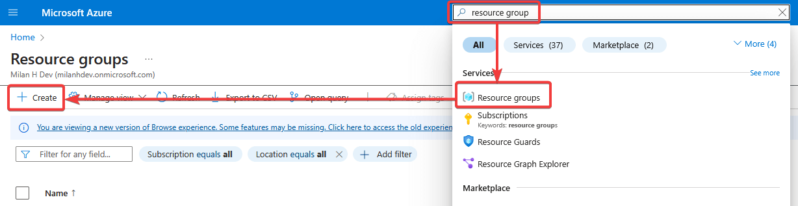

1. Create a new Function App.

    Create a new Azure Function App in the resource group you just created.

    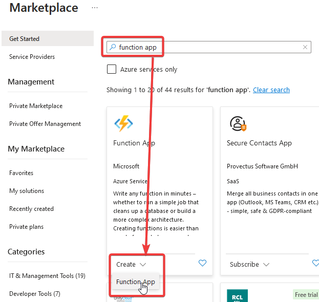

    In this guide, we are creating an Azure Function with a consumption plan.
    Fill out the required fields of the form and click on the `Review + create` button.
    While CLI for Microsoft 365 works on multiple platforms, this guide only explains the setup on a PowerShell Azure Function running on **Windows**.

    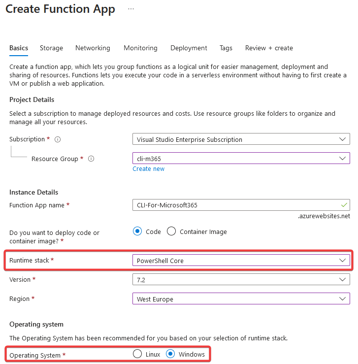

1. Wait for the creation to complete and open the Azure Function app.

1. Setup the environment variables.

    Navigate to the `Environment variables` tab.
    Over there, add a new environment variable with name `WEBSITE_NODE_DEFAULT_VERSION` and value `~20` to set the right Node version.
    Finally press `Apply`.

    :::note

    At the time of writing, the LTS version of Node.js is v20.
    We recommend to run CLI for Microsoft 365 on the LTS version of Node.js.
    Visit the [website of Node.js](https://nodejs.org) to discover the current LTS version of Node.js and update the `WEBSITE_NODE_DEFAULT_VERSION` environment variable accordingly.

    :::

    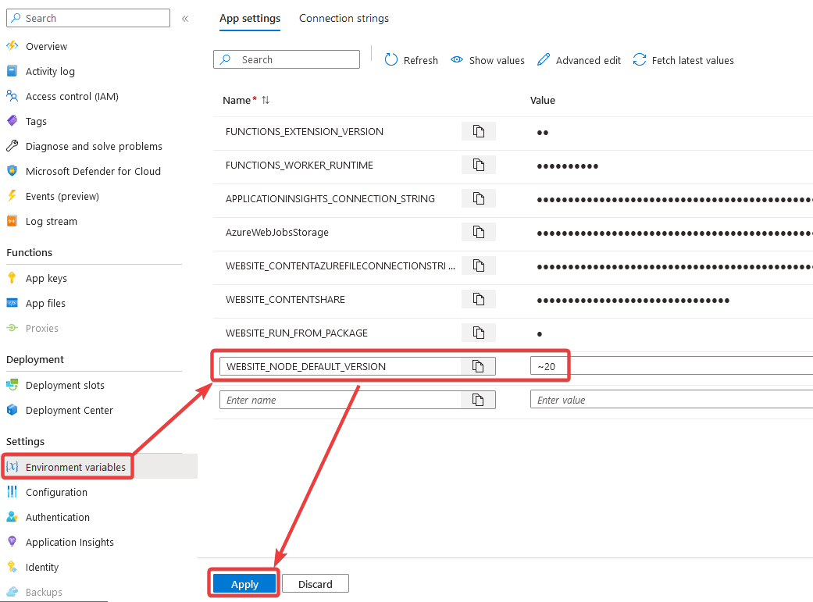

    :::tip

    To prevent automatic update checks in your Azure Function, add an additional environment variable with name `CLIMICROSOFT365_NOUPDATE` and value `1`.
    This will prevent CLI from checking if new versions are available, not giving you unwanted update notifications in your logs.

    :::

1. Reboot the Azure Function.

    On the overview tab of your Azure Function, reboot your Azure Function in order to use the configured Node version.

    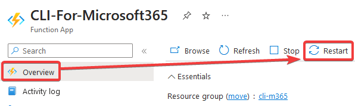

## Setting up local project

1. Use the right Node.js version.

    On your local environment, make sure that you have the same Node.js version installed as configured on the Azure Function app.

1. Create a new Azure Function project.

    Using the Azure plugin from Visual Studio Code, let's create a new Azure Function project.
    Select `PowerShell` as the language and `HTTP trigger` as the template. For this demo, let's use authorization level `anonymous`.

    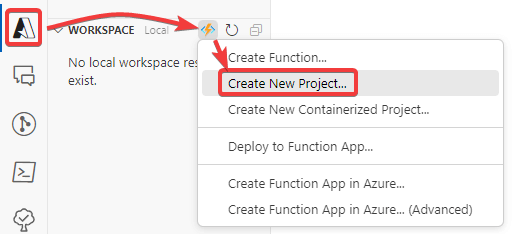

1. Create `package.json` file in the root of the project.

    To use CLI for Microsoft 365 in this Azure Function, we have to install it locally in the project. When everything is ready to go, we will publish CLI for Microsoft 365 with out code to the Azure Function.
    This will prevent the need to install the CLI for Microsoft 365 on the Azure Function itself at every execution.
    The easiest way to do achieve this is by creating a `package.json` file in the root of your project project (or run `npm init`).
    Make sure your file looks like this (choose your own project name and version):

    ```json title="package.json"
    {
      "name": "azure-function-cli-microsoft-365",
      "version": "1.0.0"
    }
    ```

1. Install CLI for Microsoft 365 in the project.

    Run the following command in your terminal at the root of your project. This will install the CLI for Microsoft 365 in the project locally.

    ```sh
    npm i @pnp/cli-microsoft365
    ```

1. Update `profile.ps1` file.

    The `profile.ps1` file is a script that runs every time your function app starts up on a new instance.
    This behavior is similar to how PowerShell profiles work on your local machine but tailored for the Azure Functions environment.
    The primary purpose of `profile.ps1` is to allow you to run initialization code for your function app.
    This could include setting up environment variables, loading custom modules, or executing any startup tasks required before your functions can run.
    In the case of CLI for Microsoft 365, we need to make sure that the CLI is available in the context of the Azure Function.

    Overwrite the content of the `profile.ps1` file with the following content:

    ```powershell title="profile.ps1"
    # Ensure CLI for Microsoft 365 environment path is available in the Azure Function
    # This way, PowerShell will understand where to find the CLI for Microsoft 365
    $functionPath = "$PSScriptRoot\node_modules\.bin" 
    if ($Env:PATH.Contains($functionPath) -eq $false) {
      [System.Environment]::SetEnvironmentVariable('PATH', $Env:PATH + ";$functionPath")
    }

    # Ensure CLI for Microsoft 365 is configured properly for executing in an Azure Function.
    m365 setup --scripting --skipApp
    # Use Azure managed identity to authenticate
    m365 login --authType identity --ensure
    # The next line is not mandatory, but it's a good practice to set the URL of your tenant.
    # This way CLI for Microsoft 365 doesn't need extra permissions to discover your SharePoint root URL.
    # Replace with your own tenant URL
    m365 spo set --url "https://contoso.sharepoint.com"
    ```

## Creating a new function

Open the `Azure` tab in Visual Studio Code and click on the `Create Function` button to create a new Function.

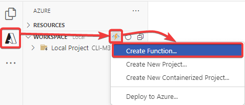

### HTTP trigger

1. Create a new HTTP trigger function.

    Choose `HTTP trigger` as the template and give it a proper name. For this demo, let's use `GetSitesFromHub`.
    For the sake of this demo, let's use authorization level `anonymous`.

1. Configure the Azure Function.

    Creating a new Azure Function will create a new folder in your project with the name of the function.
    Open the `function.json` file in this folder to configure your function.
    In this demo, we want to use the `GET` method. Let's modify the file so it looks like this:

    ```json title="/GetSitesFromHub/function.json"
    {
      "bindings": [
        {
          "authLevel": "anonymous",
          "type": "httpTrigger",
          "direction": "in",
          "name": "Request",
          // highlight-start
          "methods": [
            "get"
          ]
          // highlight-end
        },
        {
          "type": "http",
          "direction": "out",
          "name": "Response"
        }
      ]
    }
    ```

1. Add your code to the Azure Function.

    Open the `run.ps1` file in the function folder and add your code.
    In this demo, we'll create an HTTP endpoint that returns all sites that are linked to a specific hub site.

    <details>
      <summary>Click here to see the demo code</summary>
      ```powershell title="/GetSitesFromHub/run.ps1"
      using namespace System.Net

      param($Request, $TriggerMetadata)

      $hubSiteUrl = $Request.Query.Url

      Write-Host "Hub site URL: '$hubSiteUrl'."
      $hubSite = m365 spo site get --url "$hubSiteUrl" | ConvertFrom-Json

      Write-Host "Hub site ID: '$($hubSite.Id)'."
      $sites = m365 spo tenant site list --query "[?HubSiteId == '/Guid($($hubSite.Id))/']" | ConvertFrom-Json
      
      Write-Host "Return '$($sites.Count)' linked sites."
      Push-OutputBinding -Name Response -Value ([HttpResponseContext]@{
        StatusCode = [HttpStatusCode]::OK
        Body = $sites
      })
      ```
    </details>

### Timer trigger

1. Create a new timer trigger function.

    Choose `Timer trigger` as the template and give it a proper name. For this demo, let's use `GroupStats`.
    For the sake of this demo, let's use schedule `0 0 6 * * Mon` to run it every Monday at 6 AM.

1. Add your code to the Azure Function.

    Open the `run.ps1` file in the function folder and add your code.
    In this demo, we'll create a timer trigger that lists all orphaned Microsoft Entra groups and sends an email with an overview every Monday at 6 AM.

    <details>
      <summary>Click here to see the demo code</summary>
      ```powershell title="/GroupStats/run.ps1"
      param($Timer)

      Write-Host "PowerShell Timer trigger function executed at: '$((Get-Date).ToString('yyyy-MM-dd HH:mm'))'"

      $m365Groups = m365 entra group list --type microsoft365 | ConvertFrom-Json
      $mailSecurityGroups = m365 entra group list --type mailEnabledSecurity | ConvertFrom-Json
      $securityGroups = m365 entra group list --type security | ConvertFrom-Json
      $distributionGroups = m365 entra group list --type distribution | ConvertFrom-Json

      $total = $m365Groups.Length + $mailSecurityGroups.Length + $securityGroups.Length + $distributionGroups.Length
      Write-Host "Found $total groups."

      $message = @"
      <p>There are <b>$total</b> groups in Microsoft Entra ID.</p>
      <table>
        <thead>
          <tr>
            <th>Group type</th>
            <th>Count</th>
          </tr>
        </thead>
        <tbody>
          <tr>
            <td>Microsoft 365</td>
            <td>$($m365Groups.Length)</td>
          </tr>
          <tr>
            <td>Security</td>
            <td>$($securityGroups.Length)</td>
          </tr>
          <tr>
            <td>Mail enabled security</td>
            <td>$($mailSecurityGroups.Length)</td>
          </tr>
          <tr>
            <td>Distribution</td>
            <td>$($distributionGroups.Length)</td>
          </tr>
        </tbody>
      </table>
      "@

      # Send an email with the stats
      # Replace the email addresses with your own
      m365 outlook mail send --subject "Microsoft Entra group stats" --to "john.doe@contoso.onmicrosoft.com" --sender "noreply@contoso.onmicrosoft.com" --bodyContents "$message" --bodyContentType HTML --importance high
      ```
    </details>

## Granting permissions

In order to run the Azure Function, you need to grant the necessary permissions to the Azure Function.
In this guide, we are using the Azure managed identity to authenticate with CLI for Microsoft 365.
This way, you don't have to store any credentials in your Azure Function.

:::note

There are many ways to authenticate with CLI for Microsoft 365. In this guide, we are using the Azure managed identity.
If you want to use a different authentication method, please refer to the [log in to Microsoft 365 documentation](../connecting-microsoft-365) or the [login command documentation](../../cmd/login.mdx).

:::

1. Enable managed identity.

    Navigate to the `Identity` tab of your Azure Function and enable the system-assigned managed identity.
    Copy the Object ID of the managed identity, as you will need it in the next step.

    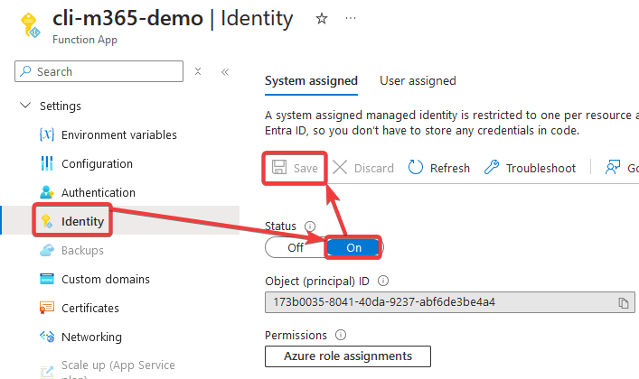

1. Grant permissions to the managed identity.

    In order to use CLI for Microsoft 365, you need to grant the necessary permissions to the managed identity.
    In this guide, out demo code needs the following permissions: `Sites.FullControl.All`, `Group.Read.All` and `Mail.Send`.
    Let's grant them to the managed identity.

    ```powershell
    # This script assumes you are logged into CLI for Microsoft 365
    # Replace the value of appObjectId with the object ID of your managed identity
    m365 entra approleassignment add --appObjectId "173b0035-8041-40da-9237-abf6de3be4a4" --resource "SharePoint" --scopes "Sites.FullControl.All"
    m365 entra approleassignment add --appObjectId "173b0035-8041-40da-9237-abf6de3be4a4" --resource "Microsoft Graph" --scopes "Group.Read.All,Mail.Send"
    ```

## Deploying the project

This section will guide you through deploying your Azure Function to Azure.

1. Sign in to Azure on Visual Studio Code.

    In Visual Studio Code, open the command palette by pressing `Ctrl+Shift+P` (Windows/Linux) or `⌘+Shift+P` (macOS).
    Search for `Azure: Sign In` and follow the instructions to sign in to your Azure account.

    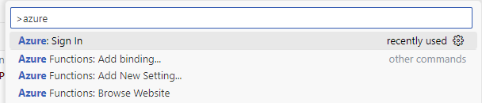

1. Using the Azure extension, deploy your Azure Function.

    Open the Azure tab in Visual Studio Code and select the subscription, resource group, and Function App you created earlier.
    Right click your Function App and choose the `Deploy to Function App...` option.

    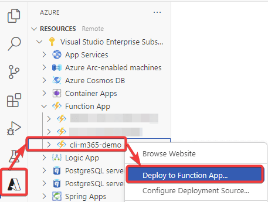

    This will deploy the entire project with the CLI for Microsoft 365 package to your Azure Function.

## Testing

To verify that the deployment was successful, when you click the `Overview` tab of your Azure Function, you should see your functions: 

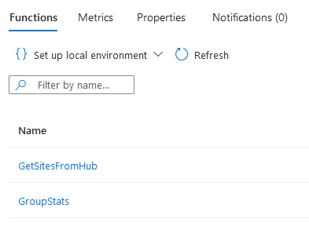

### HTTP trigger

Open the `GetSitesFromHub` function and click on the `Get Function URL` button.

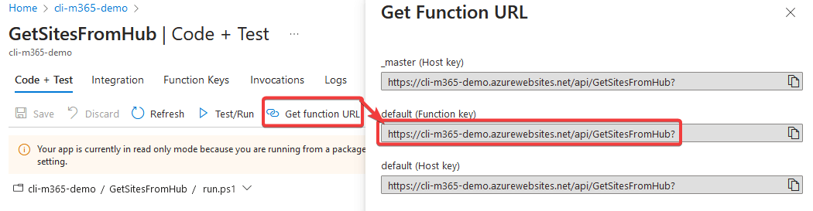

Copy the URL and paste it in your browser or an API request tool.
Add the query parameter `?Url=` to the URL and append a hub site URL of your tenant.
You should see a list of sites that are linked to the hub site.

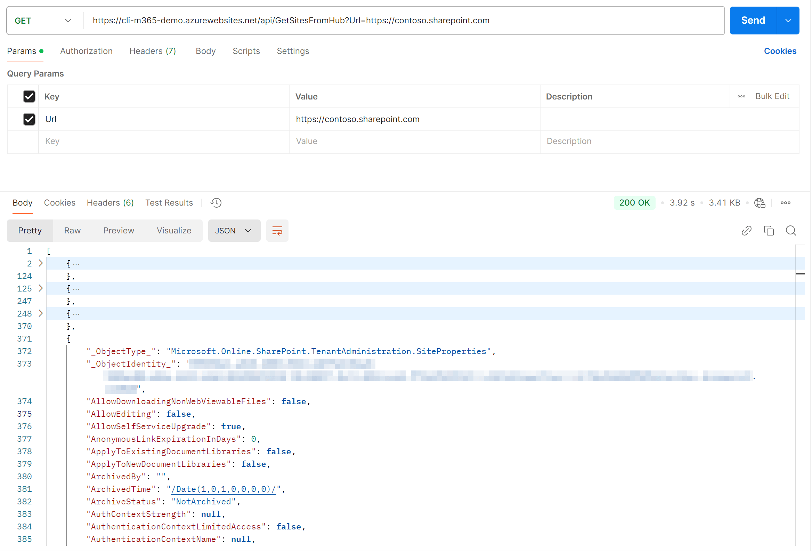

### Timer trigger

Open the `GroupStats` function and click the `Test/Run` button.

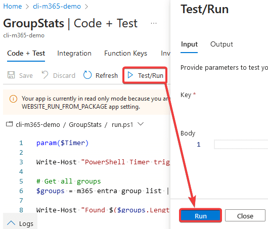

This will run the timer trigger function and send an email with the group stats to the email address you specified in the code.

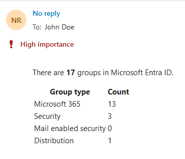
