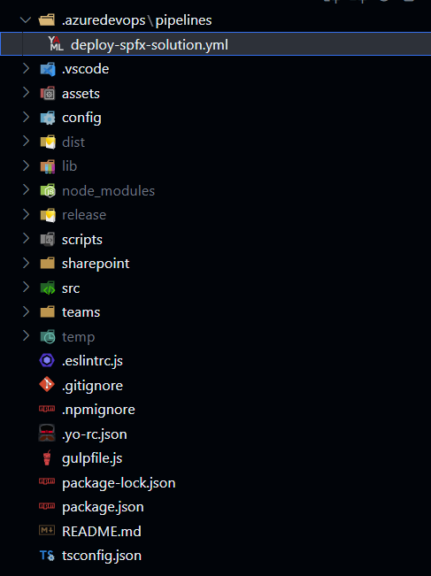
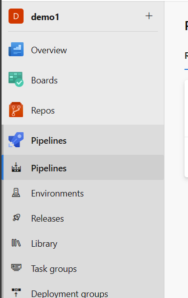
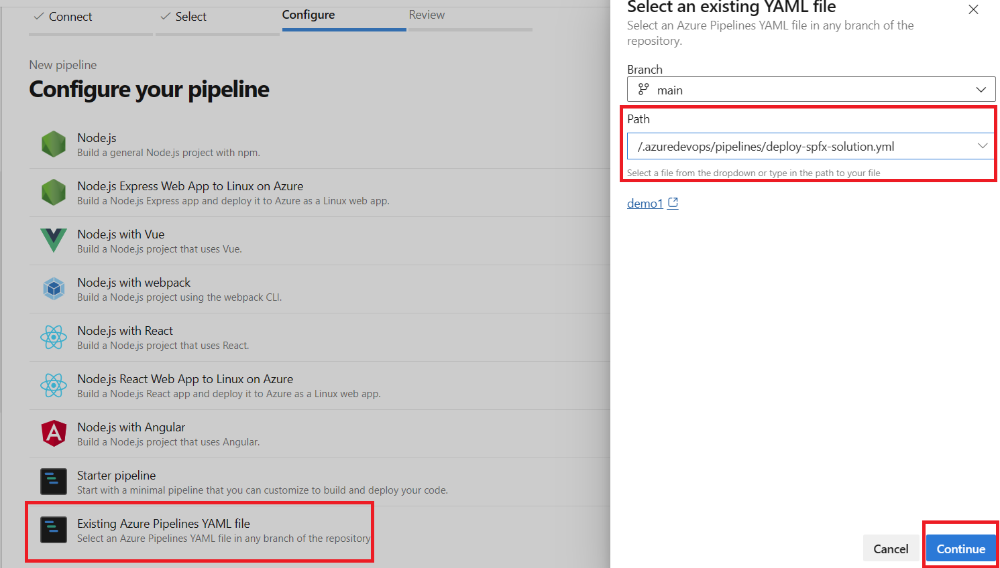
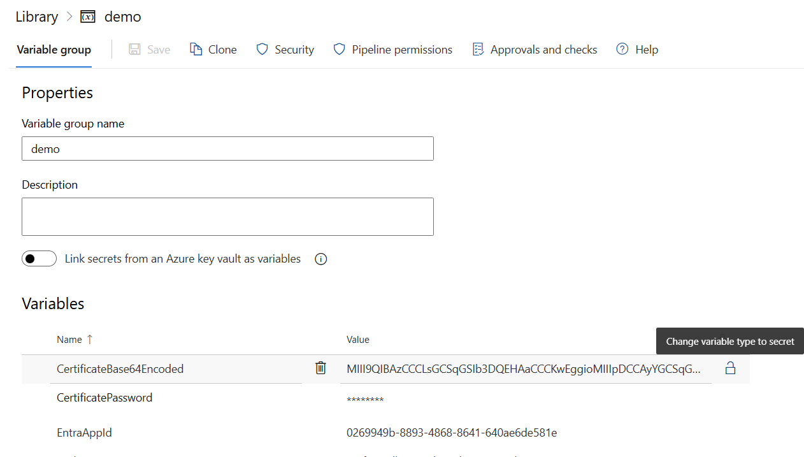

# Automate your CI/CD workflow using CLI for Microsoft 365 in Azure DevOps Pipelines

CLI for Microsoft 365 may also be used in Azure DevOps pipelines with ease. In the current guide we will go over a quite popular scenario of creating a pipeline that will allow you to build, package and deploy our SPFx solution to your tenant. This guidance assumes you already have a project/repo created on Azure DevOps and you have basic knowledge of the platform functionalities.

## Creating a new yaml workflow

First thing that we will need is a yaml file that will define our pipeline. This should be kept as one of the files in our repositories to which we plan to add the Azure DevOps pipeline. The file may be stored in any folder in the repository, but for Azure DevOps it is recommended to store your pipelines in `.azuredevops/pipelines` folder. Let's create a new file in this location and lets name it `deploy-spfx-solution.yml`. So after you've done the previous steps your SPFx project folder structure should look like this:



Now let's add the following content to the file:

```yaml
name: Deploy Solution
trigger:
  branches:
    include:
      - main
pool:
  vmImage: ubuntu-latest
variables:
  - name: CertificateBase64Encoded
    value: ""
  - name: CertificatePassword
    value: ""
  - name: EntraAppId
    value: ""
  - name: TenantId
    value: ""
  - name: SharePointBaseUrl
    value: ""
  - name: PackageName
    value: ""
stages:
  - stage: Build_and_Deploy
    jobs:
      - job: Build_and_Deploy
        steps:
          - task: NodeTool@0
            displayName: Use Node.js
            inputs:
              versionSpec: 18.x
          - task: Npm@1
            displayName: Run npm install
            inputs:
              command: install
          - task: Gulp@0
            displayName: Gulp bundle
            inputs:
              gulpFile: ./gulpfile.js
              targets: bundle
              arguments: --ship
          - task: Gulp@0
            displayName: Gulp package
            inputs:
              targets: package-solution
              arguments: --ship
          - task: Npm@1
            displayName: Install CLI for Microsoft 365
            inputs:
              command: custom
              verbose: false
              customCommand: install -g @pnp/cli-microsoft365
          - script: >
              
              m365 login --authType certificate --certificateBase64Encoded '$(CertificateBase64Encoded)' --password '$(CertificatePassword)' --appId '$(EntraAppId)' --tenant '$(TenantId)' 

              m365 spo set --url '$(SharePointBaseUrl)' 

              m365 spo app add --filePath '$(Build.SourcesDirectory)/sharepoint/solution/$(PackageName)' --overwrite 

              m365 spo app deploy --name '$(PackageName)' --appCatalogScope 'tenant'
            displayName: CLI for Microsoft 365 Deploy App

```

This yaml file will define a pipeline that will build, bundle and package your SPFx solution and then deploy it to your tenant using CLI for Microsoft 365. Let's go over the file and explain what each part does:

```yaml
name: Deploy Solution
trigger:
  branches:
    include:
      - main
pool:
  vmImage: ubuntu-latest
```

The above part of the yaml file defines the name of the pipeline and the trigger that will start the pipeline. In this case the pipeline will be triggered on every push to the `main` branch which is a quite typical use case. The last line defines the image that will be used to run the pipeline. In this case we are using `ubuntu-latest` image. 

Now let's move a bit forward. The `variables` section of the yaml file defines the variables that will be used in the pipeline. In general this is not the best approach to keep the variables values as part of your yaml file, but for the sake of simplicity we will keep them here. Later on we will show you how to store the variables in Azure DevOps Library.

Next let's go over the stages and steps of the pipeline:

```yaml
- task: NodeTool@0
  displayName: Use Node.js
  inputs:
    versionSpec: 18.x
- task: Npm@1
  displayName: Run npm install
  inputs:
    command: install
```

The above part is just a standard setup of Node version we will be using. Currently v18 as this is the latest version we may use for the currently latest version of SPFx which as of now is 1.20.0. Next we are running `npm install` to install all the dependencies of the project.

```yaml
- task: Gulp@0
  displayName: Gulp bundle
  inputs:
    gulpFile: ./gulpfile.js
    targets: bundle
    arguments: --ship
- task: Gulp@0
  displayName: Gulp package
  inputs:
    targets: package-solution
    arguments: --ship
```

The next two steps are just the standard gulp tasks that are used to bundle and package the SPFx solution. Now lets get to the part where it gets interesting:

```yaml
- task: Npm@1
  displayName: Install CLI for Microsoft 365
  inputs:
    command: custom
    verbose: false
    customCommand: install -g @pnp/cli-microsoft365
- script: >
    
    m365 login --authType certificate --certificateBase64Encoded '$(CertificateBase64Encoded)' --password '$(CertificatePassword)' --appId '$(EntraAppId)' --tenant '$(TenantId)' 

    m365 spo set --url '$(SharePointBaseUrl)' 

    m365 spo app add --filePath '$(Build.SourcesDirectory)/sharepoint/solution/$(PackageName)' --overwrite 

    m365 spo app deploy --name '$(PackageName)' --appCatalogScope 'tenant'
  displayName: CLI for Microsoft 365 Deploy App
```

The above part installs latest version of CLI for Microsoft 365 and then executes a few commands in a script task.
The first command is of course the authentication. In this case we will be signing in as an app using a certificate with a password. 
The next command sets the URL of the root SharePoint site for use in SPO commands. 
Then we are using the `spo app add` command to add the SPFx package to, in this case, tenant app catalog. 
The last command, `spo app deploy` deploys the app to the tenant app catalog to make it available for installation and present in the SharePoint online store.

## Adding a Azure DevOps pipeline

Adding your yaml file and committing and pushing it to your repo is not enough to make it an Azure DevOps pipeline. In order to make it a pipeline you will need to go over a few manual steps in the Azure DevOps portal.
Creating a new pipeline in Azure DevOps is a one-time operation and then every time you update the YAML definition Azure DevOps will automatically pick up the changes. In order to create a new pipeline go pipelines page in your Azure DevOps project



Next in the top right corner of the page hit on the `New pipline` button. After that follow the for by selecting the location of your repo, next the branch on which the YAML file is present and then select the option to create a new pipeline based on `Existing Azure Pipelines YAML file`



After that just confirm the create process and you should see your pipeline in the list of pipelines for your repository.

## Setting up the authentication

Next thing we need is to set up the authentication for the CLI for Microsoft 365. In order to for CLI for Microsoft 365 to be able to deploy an SPFx package from Azure DevOps build artifacts to your SharePoint Online tenant it will need to authenticate as an app, yes as an app other wise we would need to use user credentials and most probably confirm the MFA popup for authentication every time the pipeline runs which is for sure a no go. First we will need to create an app registration in Entra ID portal and then create a certificate and upload it to the app registration. After that we will need to grant the app registration the necessary permissions in order to be able to deploy the SPFx package to the tenant app catalog. We could do that all manually but luckily for us we may do all that with just a few lines of code using CLI for Microsoft 365.

First lets create a new certificate which we will need to add to our app req and later on use in the pipeline for authentication. There are many ways to go about it but if you are using PowerShell you may use the following script to create a new certificate:

```powershell
$cert = New-SelfSignedCertificate -NotBefore $(Get-Date).AddDays(-1) -NotAfter $(Get-Date).AddYears(1) -FriendlyName "CI-CD-Certificate" -CertStoreLocation cert:\CurrentUser\My -Subject "CN=CICDCertificate" -KeyAlgorithm RSA -KeyLength 2048 -KeyExportPolicy Exportable
$cert | Export-Certificate -Type cer -FilePath "temp/CI-CD-Certificate.cer" -Force
```

The above creates a `CI-CD-Certificate.cer` certificate file.
Next lets get the base64 encoded version of the certificate so that later on we may use it in the pipeline:

```powershell
$password = ConvertTo-SecureString -String $passwordString -Force -AsPlainText
$cert | Export-PfxCertificate -FilePath "temp/CI-CD-Certificate.pfx" -Password $password
$pfxBytes = Get-Content "temp/CI-CD-Certificate.pfx" -AsByteStream -Raw
[System.Convert]::ToBase64String($pfxBytes) | Out-File "temp/CertificateBase64String.txt"
```

The above script will create a `CI-CD-Certificate.pfx` file and then get the base64 encoded version of the certificate and store it in a `CertificateBase64String.txt` file. 

Now lets create a new app registration in Entra ID portal and add the certificate to and the necessary permissions. We may do all that with a single line of code:

```powershell
m365 entra app add --name "My CI/CD App Reg" --apisApplication "https://microsoft.sharepoint-df.com/Sites.FullControl.All" --certificateFile ./temp/CI-CD-Certificate.cer --certificateDisplayName "CICD Certificate" --grantAdminConsent
```

That's it. You may go to your Entra ID portal and check if the app registration was created with the necessary permissions and certificate.

## Using Azure DevOps Library

After we created our app registration we could just update the yaml file of the pipeline with the values of the variables that we need to use in the pipeline. But that is not the best approach as the certificate password and the certificate base 64 encoded string will be just visible in the yaml file as plain text and also be part of your git history. In order to avoid that we may use Azure DevOps Library to store the values of the variables in a secure way and use the library in our pipeline. Lets go over the steps of how to do that.

First we will need to go to Azure DevOps Pipelines Library page and click on `+ Variable group` button. After that we will only need to specify the name of our group and we may start by adding variables to it. There are many things you may leverage to make your variables secure like integrating with Azure key vault or specifying a security Azure DevOps group that will only have edit access to the variable group. For the sake of simplicity we will just add the variables to the group and the once that are considered confidential, like password, we will mark them as secret. 



After we added all of our variables to the group we may go back to our yaml file and remove all of the variables we specified in the variables section and replace them with the following:

```yaml
variables:
  - group: 'MyVariableGroup'
```

And that's it. Now you may use the variables in your pipeline and they will be stored in a secure way in the Azure DevOps Library.

## Additional support in scaffolding your workflow

If you need help in setting up your workflow we have a command that will do exactly that for you SPFx project. The [m365 project github workflow add](../cmd/spfx/project/project-github-workflow-add) command will add a GitHub workflow to your SPFx project that will build, package and deploy your solution to your tenant.
