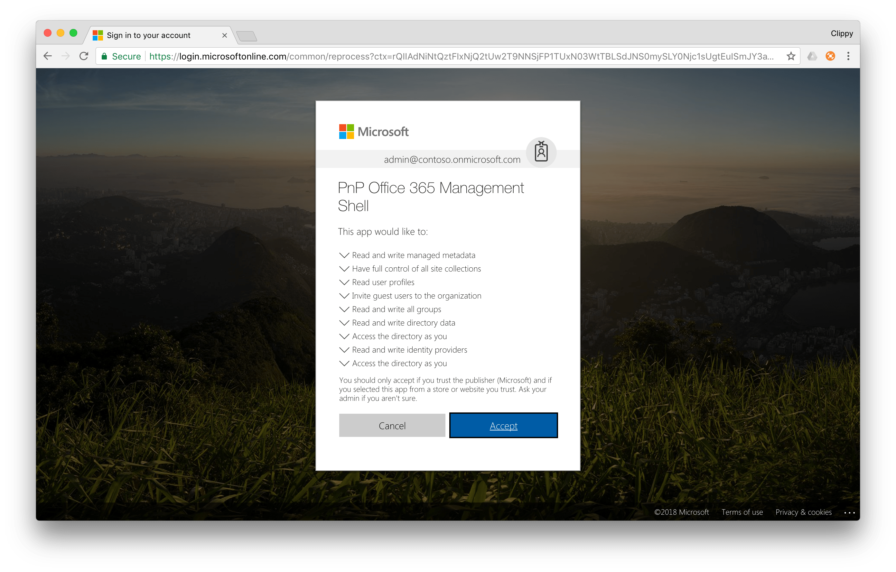

# Logging in to Microsoft 365

Before you can use CLI for Microsoft 365 commands to manage your tenant, you have to log in to Microsoft 365. Following section explains how you can log in and check the Microsoft 365 login status.

## Microsoft 365 services

Using the CLI for Microsoft 365 you can manage different areas of an Microsoft 365 tenant. Currently, commands for working with SharePoint Online, Azure Active Directory, Microsoft Graph and the Azure Management Service are available, but more commands for other services will be added in the future.

Commands in the CLI for Microsoft 365 are organized into services. For example, all commands that manage SharePoint Online begin with `spo` (`spo app list`, `spo cdn get`, etc.) and commands for working with the Azure AD begin with `aad`. After logging in to Microsoft 365, you can communicate with any Microsoft 365 service supported by the CLI for Microsoft 365 and it will automatically retrieve the necessary access token.

### Log in to Microsoft 365

CLI for Microsoft 365 offers you a number of ways to log in to Microsoft 365.

#### Log in using the default device code flow

The default way to log in to Microsoft 365 using the CLI for Microsoft 365 is through the device code flow. To log in to Microsoft 365, use the `login` command.

After executing the `login` command, you will be prompted to navigate to _https://aka.ms/devicelogin_ in your web browser and enter the login code presented to you by the CLI for Microsoft 365 in the command line. After entering the code, you will see the prompt that you are about to authenticate the _PnP Microsoft 365 Management Shell_ application to access your tenant on your behalf.

[](../images/login.png)

If you are using the CLI for Microsoft 365 for the first time, you will be also prompted to verify the permissions you are about to grant the CLI for Microsoft 365. This is referred to as _consent_.

[](../images/consent.png)

The device code flow is the recommended approach for command-line tools to authenticate with resources secured with Azure AD. Because the authentication process is handled in the browser by Azure AD itself, it allows you to benefit of rich security features such as multi-factor authentication or conditional access. The device code flow is interactive and requires user interaction which might be limiting if you want to use the CLI for Microsoft 365 in your continuous deployment setup which is fully automated and doesn't involve user interaction.

#### Log in using user name and password

An alternative way to log in to Microsoft 365 in the CLI for Microsoft 365 is by using a user name and password. To use this way of authenticating, set the `authType` option to `password` and specify your credentials using the `userName` and `password` options.

To log in to Microsoft 365 using your user name and password, execute:

```sh
login --authType password --userName user@contoso.com --password pass@word1
```

Using credentials to log in to Microsoft 365 is convenient in automation scenarios where you cannot authenticate interactively. The downside of this way of authenticating is, that it doesn't allow you to use any of the advanced security features that Azure AD offers. If your account for example uses multi-factor authentication, logging in to Microsoft 365 using credentials will fail.

!!! attention
    When logging in to Microsoft 365 using credentials, CLI for Microsoft 365 will persist not only the retrieved access and refresh token, but also the credentials you specified when logging in. This is necessary for the CLI to be able to retrieve a new refresh token, in case the previously retrieved refresh token expired or has been invalidated.

Generally, you should use the default device code flow. If you need to use a non-interactive authentication flow, you can authenticate using a certificate or credentials of an account that has sufficient privileges in your tenant and doesn't have multi-factor authentication or other advanced security features enabled.

#### Log in using a certificate

Another way to log in to Microsoft 365 in the CLI for Microsoft 365 is by using a certificate. To use this authentication method, set the `CLIMICROSOFT365_AADAPPID` environment variable to the ID of the Azure AD application that you want to use to authenticate the CLI for Microsoft 365 and the `CLIMICROSOFT365_TENANT` environment variable to the ID of your Azure AD directory. When calling the login command, set the `authType` option to `certificate`, specify the path to the certificate private key using the `certificateFile` option and specify the certificate thumbprint using the `thumbprint` option.

To log in to Microsoft 365 using a Personal Information Exchange (.pfx) file, execute:

```sh
login --authType certificate --certificateFile /Users/user/dev/localhost.pfx --thumbprint 47C4885736C624E90491F32B98855AA8A7562AF1 --password 'pass@word1'
```

To log in to Microsoft 365 using a Privacy Enhanced Mail (PEM) certificate, execute:

```sh
login --authType certificate --certificateFile /Users/user/dev/localhost.pem --thumbprint 47C4885736C624E90491F32B98855AA8A7562AF1
```

Logging in to Microsoft 365 using a certificate is convenient for automation scenarios where you cannot authenticate interactively but also don't want to use credentials.

Because there is no user context when logging in using a certificate, you will typically create a new Azure AD application, specific to your organization and grant it the required permissions.

!!! attention
    You should keep in mind, that because the CLI for Microsoft 365 will be accessing these APIs with app-only context, you need to grant the correct application permissions rather than delegated permissions that would be used in other authentication methods.

Logging in using a certificate gives the CLI for Microsoft 365 app-only access to Microsoft 365 services. Not all operations support app-only access so it is possible, that some CLI commands will fail when executed while logged in to Microsoft 365 using a certificate.

!!! attention
    When logging in to Microsoft 365 using a certificate, CLI for Microsoft 365 will persist not only the retrieved access token but also the contents of the certificate's private key and its thumbprint. This is necessary for the CLI to be able to retrieve a new access token in case of the previously retrieved access token expired or has been invalidated.

Generally, you should use the default device code flow. If you need to use a non-interactive authentication flow, to for example integrate the CLI for Microsoft 365 in your build pipeline, you can login using a certificate or user credentials.

!!! attention
    PFX files exported from a Windows key store will not work as they are protected with either a password or Active Directory account. The private key must either be exported from the protected .pfx or newly created using 3rd party tools like OpenSSL (https://www.openssl.org/).
 
Create a new self signed certificate:

```sh
openssl req -x509 -sha256 -nodes -days 365 -newkey rsa:2048 -keyout privateKey.key -out certificate.cer
```

Create a new Personal Information Exchange (.pfx) file

```
openssl pkcs12 -export -out protected.pfx -inkey privateKey.key -in certificate.cer -password pass:"pass@word1"
```

At this point the `protected.pfx` file can be used to log in the CLI for Microsoft 365 following the instructions above for logging in using a .pfx file.

If login with the .pfx file does not work then extract the private key from a protected .pfx and unprotect it:

```sh
openssl pkcs12 -in protected.pfx -out privateKeyWithPassphrase.pem -nodes
```

At this point the `privateKeyWithPassphrase.pem` file can be used to log in the CLI for Microsoft 365 following the instructions above for logging in using a PEM certificate.

### Check login status

To see if you're logged in to Microsoft 365 and if so, with which account, use the `status` command.

If you're logged in to Microsoft 365 using a certificate, the `status` command will show the name of the Azure AD application used to log in.

### Log out from Microsoft 365

To log out from Microsoft 365, use the `logout` command. Executing the `logout` command removes all connection information such as user name, refresh or access tokens stored on your computer.

<script src="https://asciinema.org/a/158294.js" id="asciicast-158294" async></script>

### Working with SharePoint Online

CLI for Microsoft 365 automatically detects the URL of your SharePoint Online tenant when executing SharePoint commands. All you need to do is to log in to Microsoft 365 with your account. Commands, that operate on specific site collections or sites, allow you to specify the URL of the site on which you want to perform the operation and you can execute them without having to specifically connect or login to the given site. CLI for Microsoft 365 will automatically retrieve the necessary access token to execute the given command.

!!! important
    Some SharePoint commands in the CLI for Microsoft 365 require access to tenant-level resources. To execute these commands, you have to have permissions to access the tenant admin site.

## Authorize with Microsoft 365

To authorize for communicating with Microsoft 365 API, the CLI for Microsoft 365 uses the OAuth 2.0 protocol. When using the default device code flow, you authenticate with Azure AD in the web browser. After authenticating, CLI for Microsoft 365 will attempt to retrieve a valid access token for the specified Microsoft 365 service. If you have insufficient permissions to access the particular service, authorization will fail with an adequate error.

If you authenticate using credentials, the authentication and authorization are a part of the same request that CLI for Microsoft 365 issues towards Azure AD. If either authentication or authorization fails, you will see a corresponding error message explaining what went wrong.

## Re-consent the PnP Microsoft 365 Management Shell Azure AD application

CLI for Microsoft 365 uses the _PnP Microsoft 365 Management Shell_ Azure AD application to log in to your Microsoft 365 tenant on your behalf. As we add new commands to the CLI, it's possible, that new permissions will be added to the _PnP Microsoft 365 Management Shell_ Azure AD application. To be able to use the newly added commands which depend on these new permissions, you will have to re-approve the _PnP Microsoft 365 Management Shell_ Azure AD application in your Azure AD. This process is also known as _re-consenting the Azure AD application_.

To re-consent the _PnP Microsoft 365 Management Shell_ application in your Azure AD, in the command line execute:

```sh
o365 cli reconsent
```

CLI for Microsoft 365 will provide you with a URL that you should open in the web browser and sign in with your organizational account. After authenticating, Azure AD will prompt you to approve the new set of permissions. Once you approved the permissions, you will be redirected to an empty page. You can now use all commands in the CLI for Microsoft 365.

## Logging in to Microsoft 365 via a proxy

All communication between the CLI for Microsoft 365 and Microsoft 365 APIs happens via web requests. If you're behind a proxy, you should set up an environment variable to allow CLI for Microsoft 365 to log in to Microsoft 365. More information about the necessary configuration steps is available at [https://github.com/request/request#controlling-proxy-behaviour-using-environment-variables](https://github.com/request/request#controlling-proxy-behaviour-using-environment-variables).

## Persisted connections

After logging in to Microsoft 365, the CLI for Microsoft 365 will persist that connection information until you explicitly log out from Microsoft 365. This is necessary to support building scripts using the CLI for Microsoft 365, where each command is executed independently of other commands. Persisted connection contains information about the user name used to establish the connection as well as the retrieved refresh- and access tokens. To secure this information from unprivileged access, it's stored securely in the password store specific to the platform on which you're using the CLI. For more information, see the separate article dedicated to [persisting connection information](../concepts/persisting-connection.md) in the CLI for Microsoft 365.
