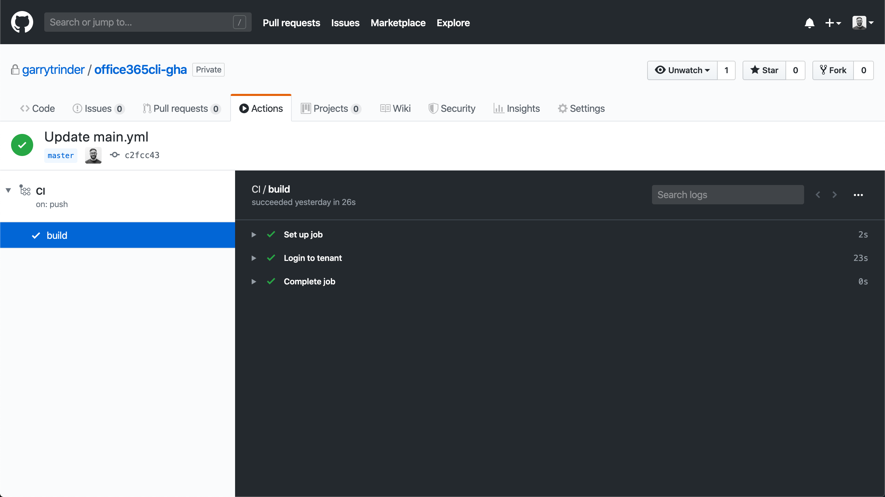

# Automate your CI/CD workflow using CLI for Microsoft 365 GitHub Actions

[GitHub Actions](https://github.com/features/actions) help you automate your software development workflows in the same place you store code and collaborate on pull requests and issues. You can write individual tasks, called actions, and combine them to create a custom workflow.

## Actions

We have built and published actions to the [GitHub Marketplace](https://github.com/marketplace?type=actions) that will enable you to easily install and execute CLI for Microsoft 365 commands from within your own custom workflows.

### CLI for Microsoft 365 Login

This action performs two roles, firstly it installs the CLI for Microsoft 365 into your build host agent and secondly, it creates a connection to your Microsoft 365 tenant which can then be used by other actions.

!!! important
    This action is required to be executed in a step before any other CLI for Microsoft 365 actions

### CLI for Microsoft 365 Deploy App

This action simplifies the installation and deployment of a SharePoint Framework app to either a tenant level or site collection level app catalog.

### Microsoft 365 Run Script

This action provides the ability to execute an inline script or script file using either `bash` or `PowerShell` as the executing shell.

## Tutorial

### Creating a basic workflow which authenticates with an Microsoft 365 tenant

We are going to assume that you have a GitHub repository already created, which you are also the owner of.

#### Create secrets

When connecting to any system or service, we need to make sure that the account details used to connect are kept in a safe and secure way. GitHub provides a way of storing these credentials in encrypted form in your repository, which can then be reused in your custom workflows.

First you will need to need to navigate, in your browser, to your repository on GitHub.com and go to the `Settings` tab, from here choose the `Secrets` item on the left hand menu.

You may have two options when registering secrets in order to log in to your tenant:

* Using username / password (perfect to test your workflow, in a dev context, for personal usage) ==> **delegated secrets**
    * *In that case, the CLI commands will run like if it was you (list item updates, site creation...)*
* Using Azure AD (AAD) application id / certificate (perfect in a production context, without creating any dependancies to an account) ==> **application secrets**
    * *Here, the CLI commands will run through an app, not a user*

##### Delegated secrets

Using the `Add new secret` link, enter the `ADMIN_USERNAME` into the `Name` field and the username of the account that you are to use to connect to your Microsoft 365 tenant with, e.g. `user@tenant.onmicrosoft.com`. *Note: This account should not be protected with multi factor authentication*

Repeat the above step to also store the account password which should be named `ADMIN_PASSWORD`.

##### Application secrets

Using the `Add new secret` link, enter the `APP_ID` into the `Name` field and the (client) id of the AAD application to connect to your Microsoft 365 tenant with, e.g. `d355e6f0-0aec-4b1f-b458-7040f91bc297`.

Repeat the above step to also store the application's encoded certificate which should be named `CERTIFICATE_ENCODED`. If your certificate is encrypted with a password, then repeat one last time the previous step with a secret called `CERTIFICATE_PASSWORD`.

#### Setup workflow

Now that we have secured the account credentials, we can start to create the workflow.

Select `Actions` tab and you will be presented with the `Get started with GitHub Actions` page. This will display a selection of templates to start your workflow from, however, for the purpose of this tutorial we will create a new workflow from scratch.

To do that, click the `Setup a workflow yourself` button which is placed on the far right of the page.

#### Update the build definition file

You will be presented with a screen displaying a file editor which has the below `yaml`. The `YAML` file represents a custom workflow and is sometimes referred to as `Build Definition as Code`.

```yaml
name: CI

on: [push]

jobs:
  build:

    runs-on: ubuntu-latest

    steps:
    - uses: actions/checkout@v1
    - name: Run a one-line script
      run: echo Hello, world!
    - name: Run a multi-line script
      run: |
        echo Add other actions to build,
        echo test, and deploy your project.
```

The above configuration defines a simple workflow named `CI` that is triggered on the `push` of new code to the repository, it contains a single `build` that is executed on an `ubuntu` hosted agent and has multiple steps that, execute a single line script and multi line script, both printing text to the logs.

We will update the initial configuration as shown below, replacing the existing steps with the `CLI for Microsoft 365 Login` action instead.

##### Login with delegated secrets
  
```yaml
  name: CI

  on: [push]

  jobs:
    build:

      runs-on: ubuntu-latest

      steps:

      - name: Login to tenant
        uses: pnp/action-cli-login@v2.2.1
        with:
          ADMIN_USERNAME:  ${{ secrets.ADMIN_USERNAME }}
          ADMIN_PASSWORD:  ${{ secrets.ADMIN_PASSWORD }}
```

##### Login with application secrets

```yaml
  name: CI

  on: [push]

  jobs:
    build:

      runs-on: ubuntu-latest

      steps:

      - name: Login to tenant
        uses: pnp/action-cli-login@v2.2.1
        with:
          APP_ID: ${{ secrets.APP_ID }}
          CERTIFICATE_ENCODED: ${{ secrets.CERTIFICATE_ENCODED }}
          CERTIFICATE_PASSWORD: ${{ secrets.CERTIFICATE_PASSWORD }}
```

The `uses` property tells the build agent to use the `CLI for Microsoft 365` GitHub Action for the step, this will automatically become available when the workflow is triggered, no installation is required.

The action accepts an admin username and password (or an application id / encoded certificate), which are used to authenticate with your Microsoft 365 tenant, these credentials are provided by an environment variable called `secrets` which contains properties exposing the secured credentials that we saved earlier.

Lastly, we need to commit the `main.yaml` file to the repository, click the `Start Commit` button and click `Commit new file`. You may want enter a custom commit message at this point, however the default will be fine for this tutorial.

#### Confirm the build has completed successfully

As we setup the workflow to be triggered on the `push` of new code to the repository, the `CI` workflow is automatically run when we initially created the workflow in the repository.

Select the `Actions` tab, this time you will be presented with a table that displays the `CI` run either in progress or completed, click on the run called `CI` in the table to view the workflow output logs.

You will see that all steps have a green tick, expanding the `Login tenant` step will display further detail generated from the `CLI for Microsoft 365 Login` action, with the last log confirming that the login was successful.  

Congratulations! You have just setup your first custom workflow in a GitHub repository and successfully logged into Microsoft 365 using the `Microsoft 365 Login` action.



#### Specify the version of CLI for Microsoft 365

Sometimes, you would like to use the next (beta) version or a previous one of the CLI (because of a bug that is currently being addressed or to leverage a new feature to come).

The `CLI for Microsoft 365 Login` action provides an optional input to specify a version tag which can be `latest` (default if not specified), `next` or a specific one (`5.9.0`).

```yaml
  name: CI

  on: [push]

  jobs:
    build:

      runs-on: ubuntu-latest

      steps:

      - name: Login to tenant
        uses: pnp/action-cli-login@v2.2.1
        with:
          APP_ID: ${{ secrets.APP_ID }}
          CERTIFICATE_ENCODED: ${{ secrets.CERTIFICATE_ENCODED }}
          CERTIFICATE_PASSWORD: ${{ secrets.CERTIFICATE_PASSWORD }}
          CLI_VERSION: next
```

#### Specify the tenant to connect to

Depending on the context, you could have to specify the tenant id if you have access to multiple tenants.

The `CLI for Microsoft 365 Login` alows you to indicate the targeting tenant (default `common`). It can be `organization` (if using an Azure AD app which is multitenant) or a tenant id.

```yaml
  name: CI

  on: [push]

  jobs:
    build:

      runs-on: ubuntu-latest

      steps:

      - name: Login to tenant
        uses: pnp/action-cli-login@v2.2.1
        with:
          APP_ID: ${{ secrets.APP_ID }}
          CERTIFICATE_ENCODED: ${{ secrets.CERTIFICATE_ENCODED }}
          CERTIFICATE_PASSWORD: ${{ secrets.CERTIFICATE_PASSWORD }}
          TENANT: 1e0e6964-032a-4e62-a8d7-4c6469d7554b
```

## How-To Guides

These guides presuppose some familiarity with using GitHub Actions and CLI for Microsoft 365.

### Deploy an app using the CLI for Microsoft 365 Deploy App action

Create a `.yaml` file within the `.github/workflow` folder with the below build definition to deploy an app to a tenant level app catalog.

```yaml
name: SPFx CI/CD with CLI for Microsoft 365

on: [push]

jobs:
  build:
    ##
    ## Build code omitted
    ##

  deploy:
    needs: build
    runs-on: ubuntu-latest
    strategy:
      matrix:
        node-version: [10.x]

    steps:

    ##
    ## Code to get the package omitted
    ##

    - name: Login to tenant
      uses: pnp/action-cli-login@v2.2.1
      with:
        APP_ID: ${{ secrets.APP_ID }}
        CERTIFICATE_ENCODED: ${{ secrets.CERTIFICATE_ENCODED }}
        CERTIFICATE_PASSWORD: ${{ secrets.CERTIFICATE_PASSWORD }}

    - name: Deploy app to tenant app catalog
      id: M365clideploy
      uses: pnp/action-cli-deploy@v3.0.1
      with:
        APP_FILE_PATH: sharepoint/solution/spfx-m365-cli-action.sppkg
        SKIP_FEATURE_DEPLOYMENT: true
        OVERWRITE: true

    - name: Get the id of the app deployed
      run: echo "The id of the app deployed is ${{ steps.M365clideploy.outputs.APP_ID }}"
```

Alternatively, you can deploy the app to a site collection based app catalog by using the below step in replacement of the `Deploy app to tenant app catalog` step.

```yaml
- name: Deploy app to a site collection app catalog
  id: M365clideploy
  uses: pnp/action-cli-deploy@v3.0.1
  with:
    APP_FILE_PATH: sharepoint/solution/spfx-m365-cli-action.sppkg
    SCOPE: sitecollection
    SITE_COLLECTION_URL: https://contoso.sharepoint.com/sites/teamsite
```

### Execute an inline script using the CLI for Microsoft 365 Run Script action

Add this step to a `.yaml` build file contained within the `.github/workflows` folder to send an email from SharePoint to a user by executing the `spo mail send` command as an inline script.

```yaml
- name: Send email
      uses: pnp/action-cli-runscript@v2.0.1
      with:
        M365_CLI_SCRIPT: m365 spo mail send --webUrl https://contoso.sharepoint.com/sites/teamsite --to 'user@contoso.onmicrosoft.com' --subject 'Deployment done' --body '<h2>CLI for Microsoft 365</h2> <p>The deployment is complete.</p> <br/> Email sent via CLI for Microsoft 365 GitHub Action.'
```

### Execute a script file using the CLI for Microsoft 365 Run Script action

Add the respective script file to your repository and this step to a `.yaml` build file contained within the `.github/workflows` folder to create lists by executing the commands contained within the script file.

```yaml
- name: Create lists
      uses: pnp/action-cli-runscript@v2.0.1
      with:
        M365_CLI_SCRIPT_PATH: ./script/lists.ps1 
```

## Reference

### CLI for Microsoft 365 Login

View on [GitHub Marketplace](https://github.com/marketplace/actions/cli-for-microsoft-365-login)

#### Inputs

| Name                    | Description                                                               |                                                        |
| ------------------------|---------------------------------------------------------------------------| -------------------------------------------------------|
| `ADMIN_USERNAME`        | The username of the account used to login                                 | Optional (but required if `authType` is `password`)    |
| `ADMIN_PASSWORD`        | The password of the account used to login                                 | Optional (but required if `authType` is `password`)    |
| `APP_ID`                | App ID of the Azure AD application to use for certificate authentication  | Optional (but required if `authType` is `certificate`) |
| `CERTIFICATE_ENCODED`   | Base64-encoded string with certificate private key                        | Optional (but required if `authType` is `certificate`) |
| `CERTIFICATE_PASSWORD`  | Password for the certificate                                              | Optional                                               |
| `TENANT`                | ID of the tenant from which accounts should be able to authenticate       | Optional                                               |
| `CLI_VERSION`           | Accepts `latest`, `next` or a specific version tag                        | Optional                                               |

### Microsoft 365 Deploy App

View on [GitHub Marketplace](https://github.com/marketplace/actions/cli-for-microsoft-365-deploy-app)

#### Inputs

| Name                      | Description                                        |          |
| --------------------------|----------------------------------------------------| ---------|
| `APP_FILE_PATH`           | Relative path of the app in your repo              | Required |
| `SCOPE`                   | Scope of the app catalog: `tenant,sitecollection`. Default is `tenant` | Optional |
| `SITE_COLLECTION_URL`     | The URL of the site collection where the solution package will be added | Required if scope is set to `sitecollection` |
| `SKIP_FEATURE_DEPLOYMENT` | `true,false` If the app supports tenant-wide deployment, deploy it to the whole tenant. Default is `false` | Optional |
| `OVERWRITE`               | `true,false` Set to overwrite the existing package file. Default is `false` | Optional |

#### Output

The `APP_ID` of the app that has been deployed.

### Microsoft 365 Run Script

View on [GitHub Marketplace](https://github.com/marketplace/actions/cli-for-microsoft-365-run-script)

#### Inputs

| Name                   | Description                  |          |
| -----------------------|------------------------------| ---------|
| `M365_CLI_SCRIPT_PATH` | Relative path to the script  | Required |
| `M365_CLI_SCRIPT`      | The script to run            | Required |
| `IS_POWERSHELL`        | Used only with `M365_CLI_SCRIPT`. If `true`, `M365_CLI_SCRIPT` will be passed as a PowerShell script, otherwise the assumption is `bash` script. Default is `false` | Optional |

!!! attention
    One of `M365_CLI_SCRIPT_PATH` / `M365_CLI_SCRIPT` is mandatory, in case both are defined `M365_CLI_SCRIPT_PATH` gets preference.

## Contributions and Issues

Due to the requirement that a GitHub action must be located within its own repository, these actions are not managed within the main CLI for Microsoft 365 repository.

If you have any ideas or issues regarding any of the actions, please raise them within the issue list of their respective repositories.

- [CLI for Microsoft 365 Login Issues](https://github.com/pnp/action-cli-login/issues)
- [CLI for Microsoft 365 Deploy Issues](https://github.com/pnp/action-cli-deploy/issues)
- [CLI for Microsoft 365 Run Script Issues](https://github.com/pnp/action-cli-runscript/issues)
