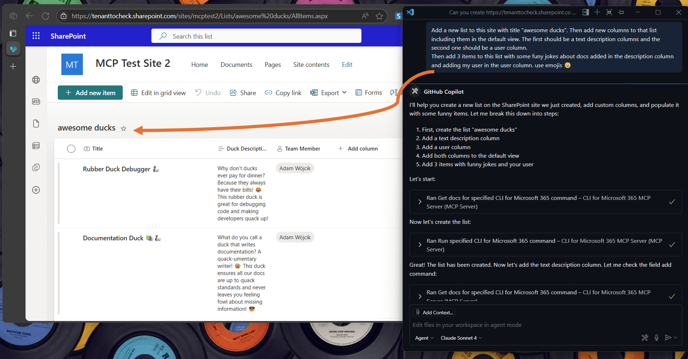
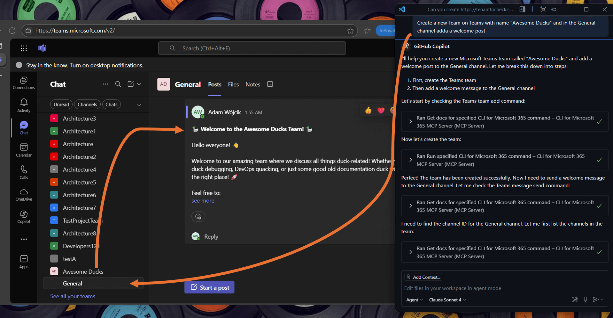
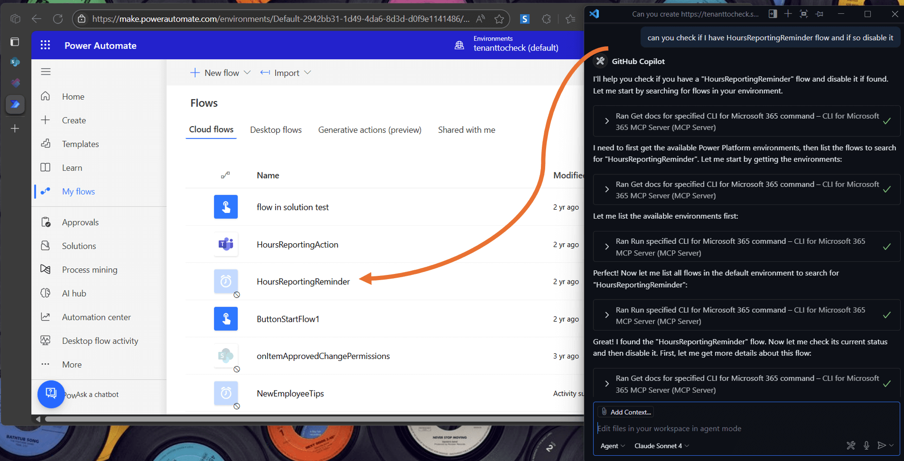
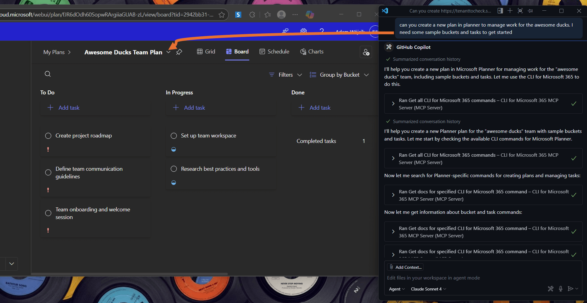

# Use CLI for Microsoft 365 MCP Server

CLI for Microsoft 365 MCP Server allows you to use natural language to manage your Microsoft 365 tenant. It is a wrapper around the CLI for Microsoft 365 commands, enabling you to use natural language which will be translated into the appropriate CLI for Microsoft 365 command or chain of commands to fulfill your request.

For the latest updates and guides, please refer to the [CLI for Microsoft 365 MCP Server repo](https://github.com/pnp/cli-microsoft365-mcp-server).

## Installation

Before getting started, please review the following prerequisites:

- Installed Node.js LTS version
- CLI for Microsoft 365 installed globally (`npm i -g @pnp/cli-microsoft365@latest`)
- CLI for Microsoft 365 setup with your Microsoft 365 tenant - you may use [m365 setup](../cmd/setup) command

After completing the prerequisites, you should update the CLI for Microsoft 365 configuration for the best experience with MCP Server. Run the following commands:

```sh
m365 cli config set --key prompt --value false
m365 cli config set --key output --value text
m365 cli config set --key helpMode --value full
```

This will ensure that the MCP server will get as much information as possible from the CLI for Microsoft 365 when an error occurs or when a command is not executed properly.

The MCP Server is installed as a Node.js package. You can install it globally using the following command:

```sh
npm i -g @pnp/cli-microsoft365-mcp-server@latest
```

The MCP server will not do any authentication for you. You will need to first authenticate using CLI for Microsoft 365 using [m365 login](../cmd/login) command. Once you are authenticated, the MCP server will use the same authentication context.

## Add MCP to VS Code

This MCP server works with any MCP client you prefer. To achieve that, refer to the instructions of your preferred MCP host. Here's how to do it in VS Code.

1. Open the Command Palette (`Ctrl+Shift+P` or `Cmd+Shift+P` on macOS) and type `MCP: Add Server`.
2. Select `Command (stdio)` as the server type.
3. Enter the command to run the MCP server, which is:

    ```sh
    npx -y @pnp/cli-microsoft365-mcp-server@latest
    ```

4. Name the server (e.g., CLI for Microsoft 365 MCP Server).

As a result, you should have the following configuration:

```json title="/.vscode/mcp.json"
{
    "servers": {
        "CLI for Microsoft 365 MCP Server": {
            "type": "stdio",
            "command": "npx",
            "args": [
                "-y",
                "@pnp/cli-microsoft365-mcp-server@latest"
          ]
        }
    }
}
```

## Using MCP Server

The following use cases are only a few examples of how you may use this MCP server. It is capable of handling many different tasks, so feel free to experiment with it and manage all of Microsoft 365 using natural language.

Also, you may check the [wiki](https://github.com/pnp/cli-microsoft365-mcp-server/wiki) to find more [scenarios](https://github.com/pnp/cli-microsoft365-mcp-server/wiki/1.-Scenarios) showing how CLI for Microsoft 365 MCP Server can be used to manage Microsoft 365.

### Manage SharePoint Online

In the following example, the MCP server created a SharePoint list with new columns and populated it with a few test items.

prompt: 

```
  Add a new list to the site with title "awesome ducks". Then add new columns to that list including them in the default view. The first should be a text description column and the second should be a user column.
  Finally, add 3 items to this list with some funny jokes about docs, added to the description column and assign my user to the user column. Use emojis 🙂
```



### Manage Microsoft Teams

The following example shows how to create a new Microsoft Teams team and add a welcome post to the General channel.

prompt:

```
  Create a new Team on Teams with name "Awesome Ducks", and in the General channel add a welcome post
```



### Manage Power Platform solutions 

In the example, the MCP server disables a Power Automate flow.

prompt:

```
  can you check if I have HoursReportingReminder flow and if so disable it
```



### Manage Planner

In the following example, the MCP server creates a new Planner plan with sample buckets and tasks.

prompt:

```
  can you create a new plan in planner to manage work for the awesome ducks. I need some sample buckets and tasks to get started
```


