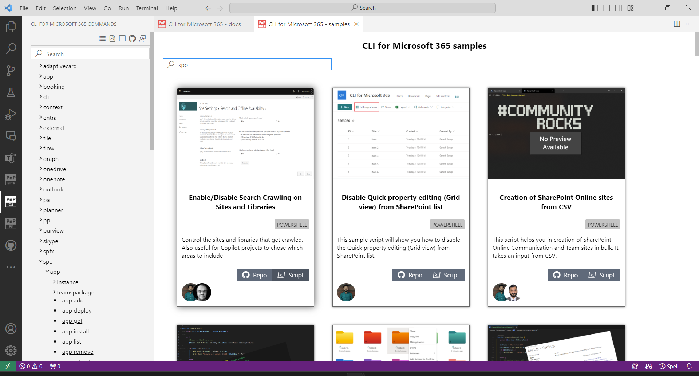

# Use CLI for Microsoft 365 VS Code extension

If you like using Visual Studio Code to write scripts as your day-to-day tool then you might want to try the CLI for Microsoft 365 VS Code extension to boost your productivity. 
It provides various features that may be helpful when creating scripts using CLI for Microsoft 365.

You may download the VS Code extension directly from the [VS Code Marketplace](https://marketplace.visualstudio.com/items?itemName=adamwojcikit.cli-for-microsoft-365-extension) or install it from the VS Code extension gallery.

Currently, the extension provides the following:

## Full docs for every CLI for Microsoft 365 command

The extension allows you to browse CLI for Microsoft 365 docs about every command inside VS Code. 

No more transition between the code editor and browser is needed. 
It is possible to go to docs original website location and also open a sample gallery showing all samples using the command.

## Samples gallery with samples

The samples gallery allows you to browse all samples available for CLI for Microsoft 365 directly from CLI and PnP Script samples.
From the samples gallery, you may go to the sample location or create a file prefilled with the CLI for Microsoft 365 script. 
It is possible to search for samples by title, authors, and commands used in samples

## Snippets with all possible commands

The extension provide coding snippets for every CLI for Microsoft 365 command. 
The command is added with all obligatory parameters. 
It is possible to quickly move between parameters using `Tab` key. 
Each CLI command snippet is also provided with the same description as may be found in the docs which is a great help to quickly understand the commands functionality.

