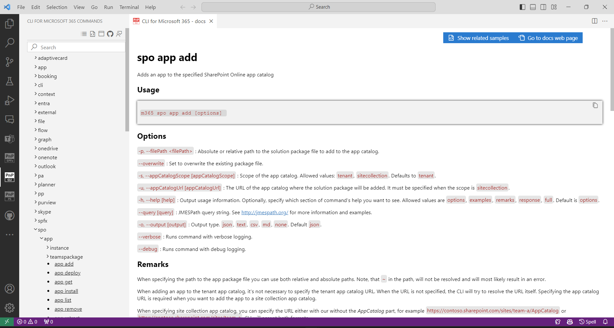
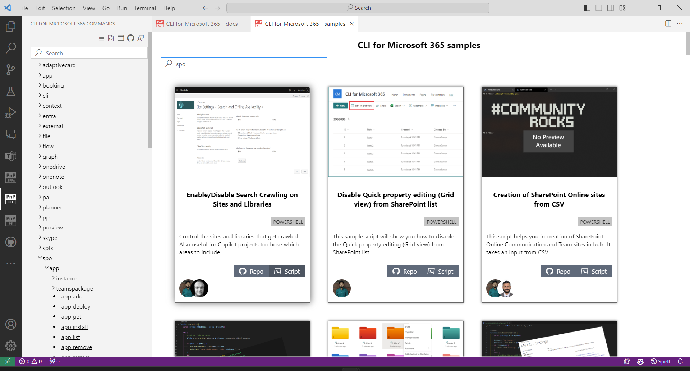
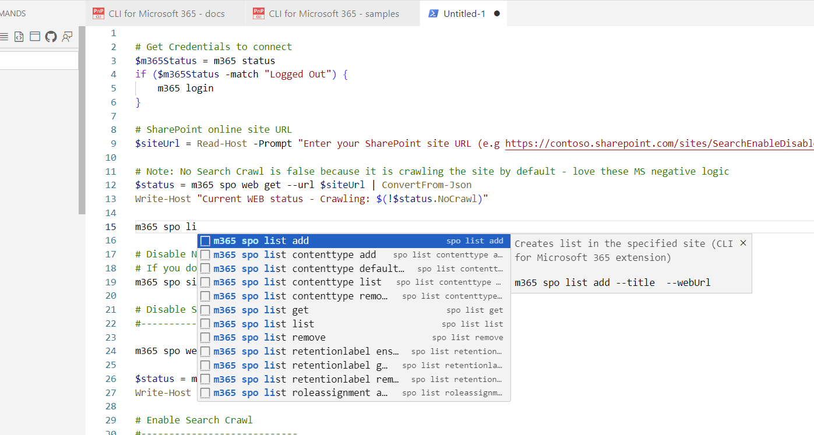

# Use CLI for Microsoft 365 VS Code extension

If you like using Visual Studio Code to write scripts as your day-to-day tool then you might want to try the CLI for Microsoft 365 Visual Studio Code extension to boost your productivity. 
It provides various features that may be helpful when creating scripts using CLI for Microsoft 365.

You may download the Visual Studio Code extension directly from the [Visual Studio Code Marketplace](https://marketplace.visualstudio.com/items?itemName=adamwojcikit.cli-for-microsoft-365-extension) or install it from the VS Code extension gallery.

As of this writing, this extension has the following features.

## Integrated docs for every CLI for Microsoft 365 command

The extension allows you to browse CLI for Microsoft 365 docs about every command inside Visual Studio Code. 

No more switching between your IDE and browser is needed. 
With a single click, you can open the docs page in your default browser, or open a sample gallery showing all samples using the command.

## Sample gallery

The sample gallery allows you to browse all samples available for CLI for Microsoft 365 directly from CLI and PnP Script samples.
From the samples gallery, you may go to the sample location or create a file prefilled with the CLI for Microsoft 365 sample script. 
It is possible to search for samples by title, authors, and commands used in samples.

## Snippets with all possible commands

The extension provides coding snippets for every CLI for Microsoft 365 command.
The command is added with all obligatory parameters.
It is possible to quickly cycle between parameters using your `tab` key.
Each CLI command snippet is also provided with the same description as may be found in the docs which is a great help to quickly understand the command's functionality.

