# Using your own Azure AD identity

When you use the CLI for Microsoft 365 to connect to your tenant for the first time, you are presented with a `Permissions requested` prompt from Azure, by accepting this prompt you are consenting to using the `PnP Microsoft 365 Management Shell` Azure AD application with your tenant as well as the permissions that it requires.

We ask for a wide range to permissions upfront, including permissions that require administrative level consent, so that it is easy to get started with the CLI and try out the commands across many CLI for Microsoft 365 workloads in your tenant without having to handle the complexity of managing the permissions for the different commands manually in Azure.

Whilst this is fine for working against development and test environments, using these levels of permissions against production environments is inconvenient and administrators are not comfortable with granting such permissions to a multi-tenant application within their environment.

In this scenario, administrators will want to provide their own Azure AD app registration to use with the CLI to enable greater control over the permissions that are granted.

This tutorial will walk you through how to create your own Azure AD application with permissions restricted to only read information about SharePoint Online Site Collections and how to use this custom application with the CLI for Microsoft 365.

## Register Azure AD application in your tenant

We first need to register a new Azure AD application in your tenant, to do this we will need to navigate to the [Azure Portal](https://portal.azure.com).

Select `Azure Active Directory` from the global menu, select `App registrations` in the Azure Active Directory blade and then select the `New registration` action button to open the `Register an application` form.

[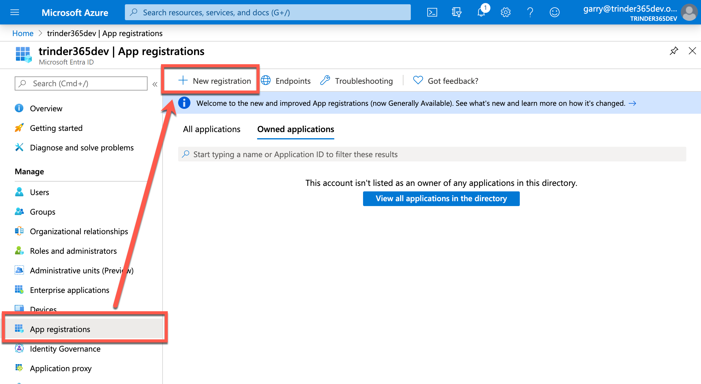](../images/using-own-identity/new-app-registration.png)

In the form, enter a name for your new application, for the purpose of this tutorial let's use `Custom PnP CLI for Microsoft 365`. You can always change this later if you want. Leave the `Supported account types` and `Redirect URI` values as they are and select the `Register` button at the foot of the form to create your custom application.

[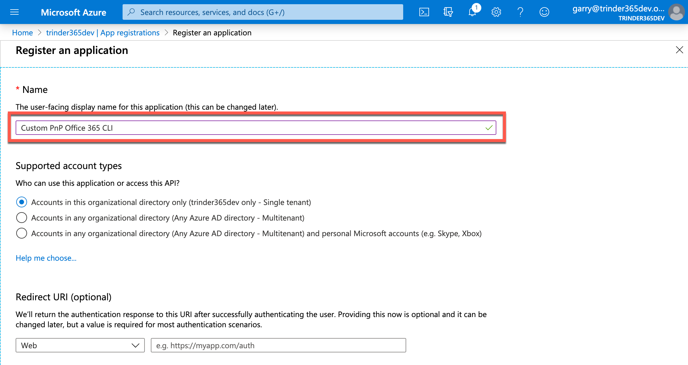](../images/using-own-identity/register-an-application.png)

After the application has been created, you will be presented with the blade for your application displaying an overview of some properties of the application. At this point it is a good idea to take note of two key pieces of information that we will need later.

[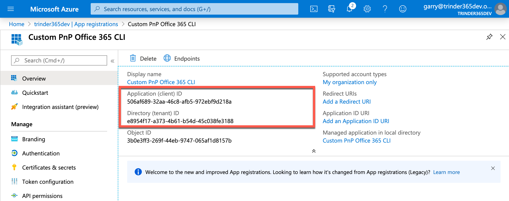](../images/using-own-identity/client-and-tenantid.png)

Take a copy of both the `Application (client) ID` and `Directory (tenant) ID` values and save them to a place for you to refer back to them later.

## Configure Authentication settings

We next need to configure our new application so that it can be used with the CLI for Microsoft 365. To do this we need to select `Authentication` in the `Custom PnP CLI for Microsoft 365` blade menu.

This will present you with three sections: `Platform configuration`, `Supported account type` and `Advanced settings`.

Select the `Add a platform` button to open up the `Configure platforms` menu and under the `Mobile and desktop applications` heading, select `Mobile and desktop applications`. This will open another menu called `Configure Desktop + Devices` displaying a section called `Redirect URIs` and a list of checkboxes with some pre-defined URIs.

[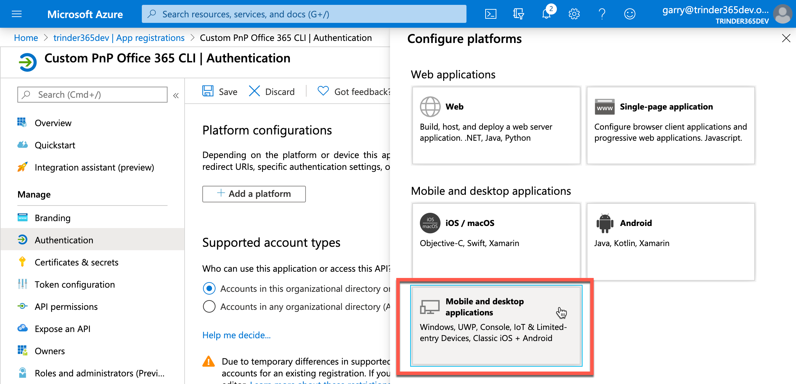](../images/using-own-identity/configure-platforms.png)

Select the first option in the list, `https://login.microsoftonline.com/common/oauth2/nativeclient` and select the `Configure` button at the foot of the menu.

[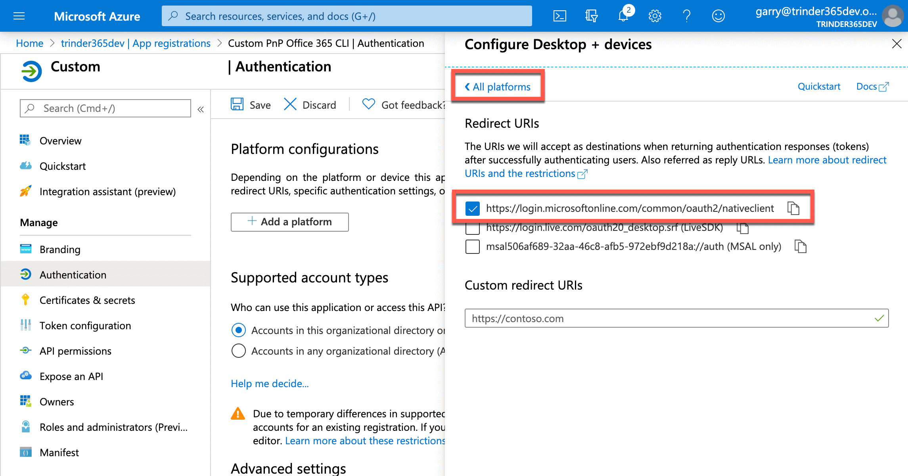](../images/using-own-identity/configure-desktop-and-devices.png)

This will refresh the `Authentication` blade and will display the Redirect URI we just chose from the menu.

[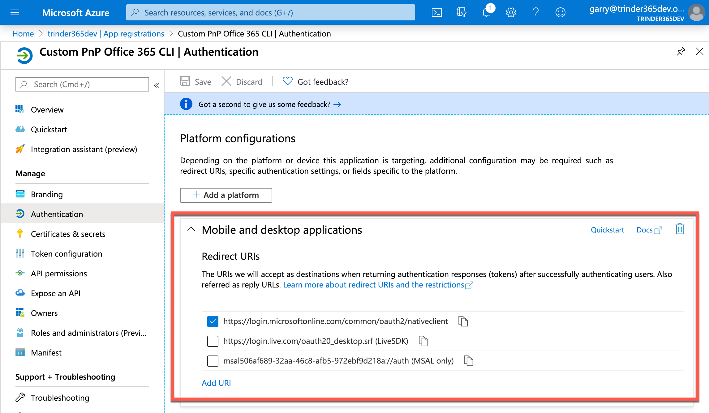](../images/using-own-identity/mobile-and-desktop-applications.png)

!!! info
    This Redirect URI is specific to the use of authentication methods that do not use a web interface for authenticating users and are therefore called `Native Clients`. This is the category that the CLI for Microsoft 365 falls into.

Moving on, we can skip over the `Supported account type` section, as this is defaulted to `Accounts in this organizational directory only (<tenant> only - Single tenant)` meaning, that only users within the current tenant directory can use this application. In the `Advanced settings` section, we need to enable the `Default client type` toggle, as we are using the `Device code flow` method to authenticate to our tenant using the CLI for Microsoft 365.

[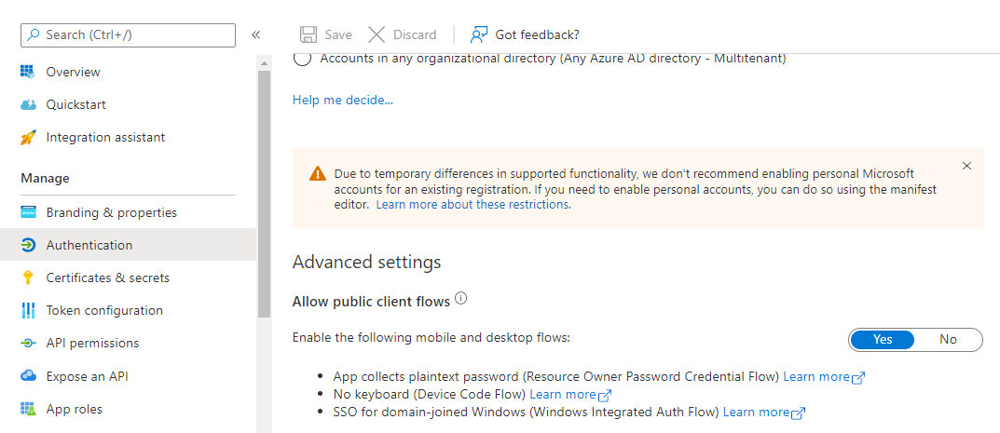](../images/using-own-identity/advanced-settings.png)

To make sure all these changes are applied, select the `Save` button before moving on.

## Configure API Permissions

Now that we have configured the application to work with the CLI for Microsoft 365, we next need to grant what permissions the CLI will have within our tenant. Select the `API permissions` in the `Custom PnP CLI for Microsoft 365` blade menu.

You will see a section called `Configured permissions` with one permission already granted. This is the default permission which allows the application to sign in the user account used when authenticating to the Microsoft Graph.

[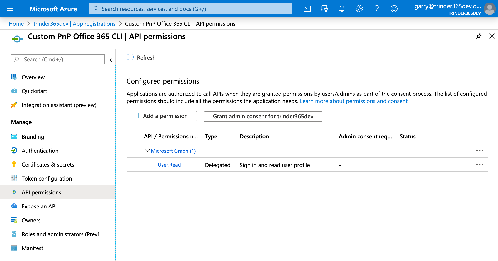](../images/using-own-identity/configured-permissions.png)

Select the `Add a permission` button to open the `Request API permissions` menu. As we are only interested in granting our application access to SharePoint Online for the purpose of this tutorial, select `SharePoint` in the list of APIs that are available.

[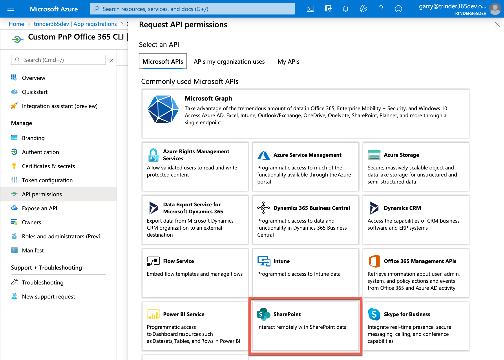](../images/using-own-identity/request-api-permissions.png)

This opens the menu with two options: `Delegated permissions` or `Application permissions`. As we are going to be communicating with the SharePoint Online APIs as the authenticated user, select `Delegated permissions`. This will display a list of available permissions that we can choose from.

For the purpose of this tutorial we only want to grant read access to SharePoint Online, so expand the `AllSites` grouping and select the `AllSites.Read` permission. Next, select the `Add permissions` button to apply these permissions.

[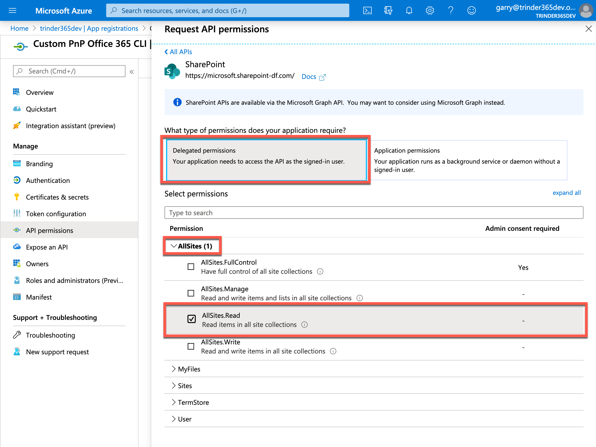](../images/using-own-identity/spo-delegated-permissions.png)

!!! attention
    Note that the `AllSites.Read` permission does not directly grant the signed-in user access to all sites in SharePoint Online. As we authenticate as the signed-in user, that user must still have access to the SharePoint sites that we want to return information about, otherwise the SharePoint Online API calls will fail with a `401 Unauthorized` error.

You will be presented with the `Configured permissions` section again but this time the `AllSites.Read` permission will be shown under the `SharePoint` grouping.

[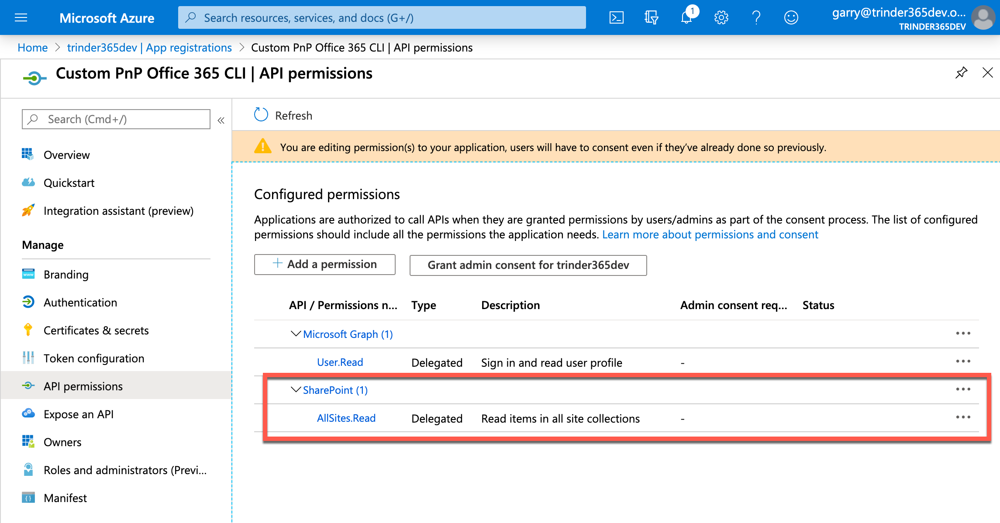](../images/using-own-identity/spo-configured-permissions.png)

This completes the configuration required in the Azure portal. We can now move onto configuring the CLI for Microsoft 365 to use our custom application to login to Microsoft 365.

## Create environment variables

To configure the CLI for Microsoft 365 to use our newly created custom application, we need to tell it the Client ID of our custom application and the Tenant ID of where the custom application has been created.

To do that, we need to create two environment variables, named `CLIMICROSOFT365_AADAPPID` and `CLIMICROSOFT365_TENANT`, giving them the values that you saved earlier.

How you set the environment variables depends on the operating system and shell that you are using.

If you are on Windows, you can set the environment variables using the `$env:<variable-name>` approach in a PowerShell session.

```powershell
$env:CLIMICROSOFT365_AADAPPID="506af689-32aa-46c8-afb5-972ebf9d218a"
$env:CLIMICROSOFT365_TENANT="e8954f17-a373-4b61-b54d-45c038fe3188"
```

!!! tip
    Execute `$env:CLIMICROSOFT365_AADAPPID` and `$env:CLIMICROSOFT365_TENANT` to verify that the environment variables have been created correctly

If you are using Linux or macOS, you can set the environment variables using the `export` command from your terminal prompt.

```sh
export CLIMICROSOFT365_AADAPPID=506af689-32aa-46c8-afb5-972ebf9d218a
export CLIMICROSOFT365_TENANT=e8954f17-a373-4b61-b54d-45c038fe3188
```

!!! tip
    Execute `printenv` to verify that the environment variables have been created correctly

Now that we have set our environment variables, we are now ready to use our custom application to log in with using the CLI for Microsoft 365.

## Login and consent

For the purpose of this tutorial, we will be using the `Device code flow` to interactively authenticate with an Microsoft 365 tenant. As this is the first time that we will have used the custom application to authenticate, we will also be required to give our consent.

At your terminal session, execute `m365 login` to start the authentication process, a login device code will be displayed along with a link to a web page where it needs to be entered. Navigate to [https://microsoft.com/devicelogin](https://microsoft.com/devicelogin), enter the code into the input field and select `Next`. You will then be presented with either a login screen or accounts that you have already logged in to Microsoft 365 with. Login with or choose the account from the list that you want to use with CLI for Microsoft 365.

You will now be prompted to consent that the custom application, `Custom PnP CLI for Microsoft 365`, can use the two permissions that we configure earlier, `Read items in all site collections` and `Sign you in and read your profile` on your behalf. Select `Accept` to consent and complete the sign-in process.

Returning back to your command line, you can now verify that the sign in has been successful by executing the `m365 status` command.

Finally, to test that we can indeed read SharePoint Online site collections, let's invoke the following command

```sh
m365 spo site get --url https://trinder365dev.sharepoint.com -o json
```

The JSON representation of the SharePoint Online site will be returned to the console.

Congratulations! You have just configured the CLI for Microsoft 365 to use your own custom application with custom permissions from your own Azure Active Directory.

[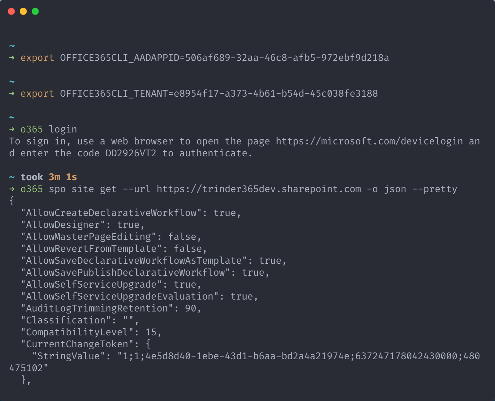](../images/using-own-identity/congratulations.png)

## Persisting environment variables

As mentioned earlier, the way in which we set the environment variables meant that they are only set for the lifetime of the session, if the terminal session is closed, you will need to repeat those steps, which may be undesirable.

How you permanently set the environment variable is dependant on the operating system and shell you are using.

If you are on Windows, you can set the environment variables using the `Edit the system environment variables` approach in the Windows UI.

Search for `Edit the system environment variables` in Start Menu and launch it. Select `Environment Variables`, under the `User variables for <user-name>` section, select `New...` to add a new variable. In the dialog, in the variable name field enter `CLIMICROSOFT365_AADAPPID` and set the value using the Client ID (quotes should be omitted). Select `OK` to save the value and repeat the process for the `CLIMICROSOFT365_TENANT` variable. Select `OK` until all windows are closed to persist the changes.

Open a new PowerShell session and execute `$env:CLIMICROSOFT365_AADAPPID` and `$env:CLIMICROSOFT365_TENANT` to verify that the environment variables have been created correctly.

If you are on Linux or MacOS, depending on your terminal, add the  `export` lines to `.bashrc` or `.zshrc` file in your home directory.

If you are using PowerShell Core, it is worth noting that environment variables set in `bash` or `zsh` will persist to the `pwsh` session and the same applies to Windows.
