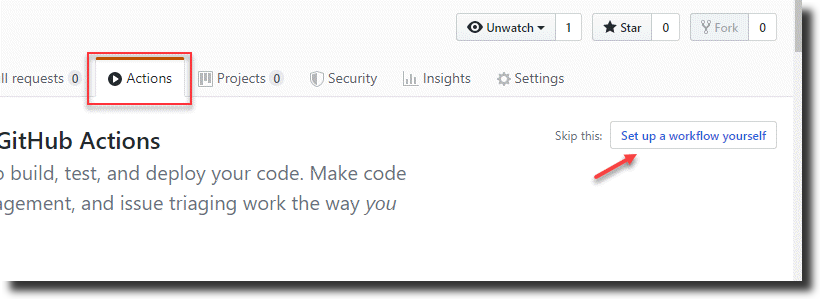
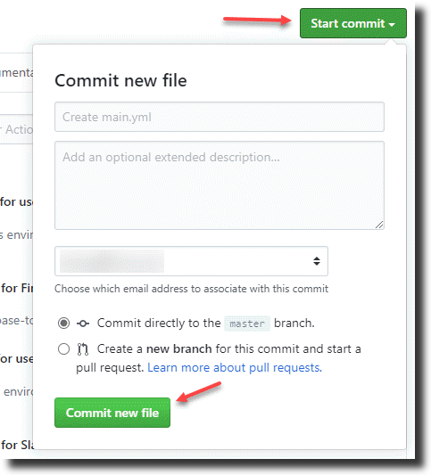
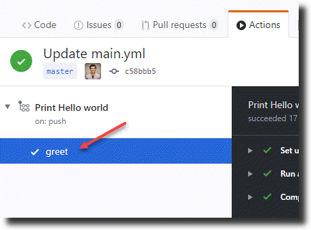
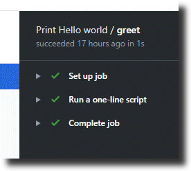
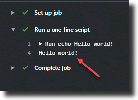

# Creating a simple workflow

To create a simple workflow, navigate to any repository of yours and click on `Actions` and then on `Set up a workflow yourself`. 



GitHub will automatically create a simple workflow (main.yml file) for you. Let's erase all the code in that and instead add the following code.

```yaml
name: Print Hello world

on: push

jobs:
  greet:

    runs-on: windows-latest

    steps:
    - name: Run a one-line script
      run: Write-Host Hello world!
```
This code prints `Hello world!` when a file is pushed to the repo (we will come to know soon where this gets printed).

Click on **Start commit** and then click on **Commit new file** to save this workflow. 



Congratulations you have now created a GitHub workflow. How easy was that!

## Walkthrough

Let's quickly walk through what is present in the workflow file we created:
- On line number 1, we give a name to our workflow called `Print Hello world`.
- Next in line number 3 (`on: [push]`), we are telling GitHub to start this workflow when any file is pushed to the current repository.
- Each workflow will have one or more jobs it needs to execute. For this workflow we are defining only one job and we give it a name called `greet` on line number 6.
- Each job runs in an environment (windows, linux or mac). This is determined by the `runs-on` attribute of the job. In this case we are specifying `windows-latest`. So the job named `greet` will run on a machine which has `windows-latest` on it (which is Windows Server 2019 at the time of writing this document).
- Each job consists of one more steps (tasks) it needs to run. This is represented by line number 10. In this case there is only step named `Run a one-line script` as shown on line number 11.
- A step can (in it's simplest form) run one or commands. There are other things which a step can do - we will look at that later. In this case, all the step does is run a PowerShell command called `Write-Host Hello world!`. 

## Seeing the workflow run

Now, since we created this new workflow file i.e. since we have pushed a file, the workflow will start running. To see that, click on `Actions` again. 
- We can see that our workflow `Print Hello world` would be running (or would have completed). 
- If we click on that, on the left side we see all the jobs in that workflow. In this case there is only one job named `greet`.

- The right side shows the steps in that job. We can see that there are 3 steps. `Set up job`, `Run a one-line script` and `Complete job`.
- GitHub automatically creates the steps `Set up job` and `Complete job` for each job. 

- `Run a one-line script` is the one we created in our workflow. So if we expand that by clicking on it, we can see that `Hello world!` is printed. 


That concludes creating a simple workflow in a GitHub repo. More details on the syntax explained above can be found [here](https://help.github.com/en/actions/automating-your-workflow-with-github-actions/workflow-syntax-for-github-actions).

Next, let's look into [creating a workflow in which we can use some actions](./workflowusingactions.md).