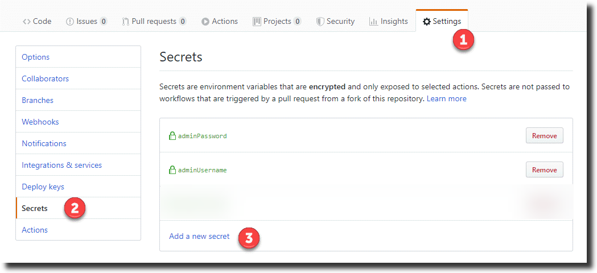
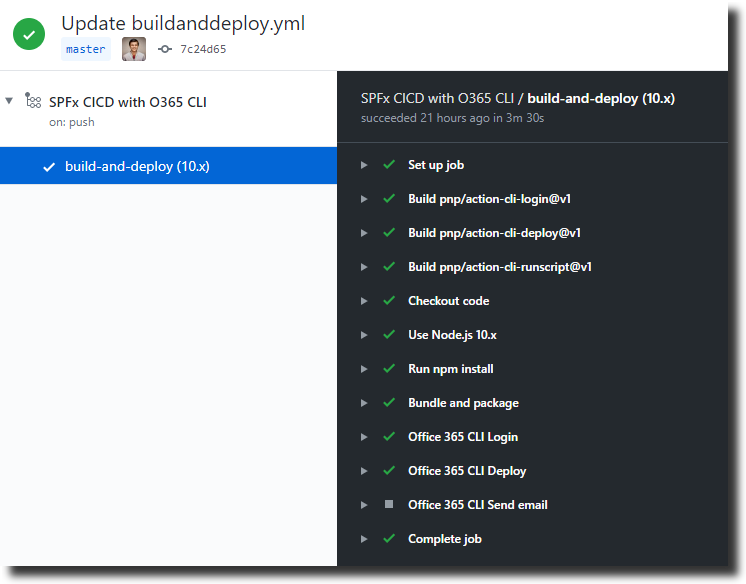

# A workflow for SPFx project

As SPFx developers, it would be very handy when we say push code or make a pull request (to a certain branch) the following happen in a GitHub workflow:
- our code is built, 
- .sppkg file is created, 
- then it is uploaded to app catalog and 
- then deployed as well. 

As we have seen in the earlier documentation, we can run commands in a workflow. Hence in the workflow we can run commands related to bundling the code `gulp bundle --ship` and  packaging the code `gulp package-solution --ship`. This will give us the .sppkg file.

If we have the .sppkg file, we know we can do the upload and deploy steps, using Office 365 CLI. So what we have done is created GitHub Actions for those tasks. These actions can be used in a workflow attached to a GitHub repository that has SPFx code.

Let's see how a workflow looks like for an SPFx project and how we can use the CLI GitHub actions in that workflow. 

## Initial setup - secrets (global constants)

In this workflow we use some sensitive information like user name and password. We do not want them to written directly in the workflow. We need to store them encrypted and secretly. So let’s start by creating these [secrets](https://help.github.com/en/actions/automating-your-workflow-with-github-actions/creating-and-using-encrypted-secrets), that will be used in the workflow. These can be thought of as environment variables. 
Navigate to the GitHub repo which has SPFx code and click on settings. Then click on secrets and the following:
- adminUsername — the email address of the tenant admin
- adminPassword — the password of that user



## The workflow

In your GitHub repo which has SPFx code, we need to create a file named `spfx_wf.yaml` in the folder `.github/workflows`. If you have created workflows before in this repo then `.github/workflows` will already exist. If you haven't created a workflow then please see the instrcutions mentioned in [this guide](./simpleworkflow.md) on how to create a yaml file. 
Enter the following code in that file

```yaml
name: SPFx CICD with Office 365 CLI

on: push

# Variables that are available for all the jobs in the workflow
env:
  SPPKG_FILE_NAME: ${{ 'package-name.sppkg' }}
  SEND_MAIL: 'true'

jobs:
  build-and-deploy:
    runs-on: ubuntu-latest
    strategy:
      matrix:
        node-version: [10.x]
    
    steps:
    # Checkout code
    - name: Checkout code
      uses: actions/checkout@v1
      
    # Setup node.js runtime
    - name: Use Node.js ${{ matrix.node-version }}
      uses: actions/setup-node@v1
      with:
        node-version: ${{ matrix.node-version }}
    
    # npm install
    - name: Run npm install
      run: npm install
    
    # gulp bundle and package solution
    - name: Bundle and package
      run: |
        gulp bundle --ship
        gulp package-solution --ship    
    
    # Login to tenant using action-cli-login
    - name: Office 365 CLI Login
      uses: pnp/action-cli-login@v1
      with:
        ADMIN_USERNAME:  ${{ secrets.adminUsername }}
        ADMIN_PASSWORD:  ${{ secrets.adminPassword }}
    
    # Deploy package to tenant using action-cli-deploy
    - name: Office 365 CLI Deploy
      uses: pnp/action-cli-deploy@v1
      with:
        APP_FILE_PATH: sharepoint/solution/${{ env.SPPKG_FILE_NAME }}
    
    # Send an email using action-cli-runscript
    - name: Office 365 CLI Send email
      uses: pnp/action-cli-runscript@v1
      with:
         O365_CLI_SCRIPT: o365 spo mail send --webUrl https://contoso.sharepoint.com/sites/teamsite --to 'user@contoso.onmicrosoft.com' --subject 'Deployment done' --body '<h2>Office 365 CLI</h2> <p>The deployment is complete.</p> <br/> Email sent via Office 365 CLI GitHub Action.'
      if: env.SEND_MAIL == 'true'

```

In the above workflow we have 1 job named `build-and-deploy`. This job has steps divided in 2 parts - `build` and `deploy`. Let's take look at what the job does.

### Build part of the job
- The intention of this part is to build our SPFx code, so that we can get the sppkg file.
- The steps in this part are pretty straight forward. First we use an action provided by GitHub called `checkout`. This will check out the repo so that workflow can access it.
- Next we set up node js by using an action (provided by GitHub) called `setup-node`.
- After that we do an `npm install`, followed `gulp bundle` and `gulp package-solution`.
- Now, we have the .sppkg file which will be in `sharepoint/solution` folder of the machine where the job running.

### Deploy part of the job
- The intention of this part is to upload and deploy the .sppkg file. We do this using CLI GitHub actions.
- First we use `action-cli-login` to login to the tenant. This action requires user name and password as inputs. Instead of supplying plain text, we use the secrets we created earlier as inputs for this action.
- After that we use `action-cli-deploy` to upload and deploy the .sppkg file. This action requires 1 input, which is the path where the package is present. 
- Optionally, we can use a third action called `action-cli-runscript` to send an email. This action accepts 1 input, which is a line of `Office 365 CLI script` we want to run.

**Make sure to update** the following before doing a commit
- the value of `SPPKG_FILE_NAME` on line number 7.
- if the value of `SEND_MAIL` is set to `true` on line number 8 then, update the `webUrl` and the `to email address` in the last but first line.

Commit the file and the we should see the workflow running and executing the job.



Once the workflow is complete, the package should be deployed to the tenant. This can be verified by navigating to the app catalog site.

## CLI GitHub Actions

In the workflow above, we used 3 GitHub actions that are developed by the PnP community and have been published. The details of what each does can be found in the links below:

- [action-cli-login](./login.md)
- [action-cli-deploy](./deploy.md)
- [action-cli-runscript](./runscript.md)