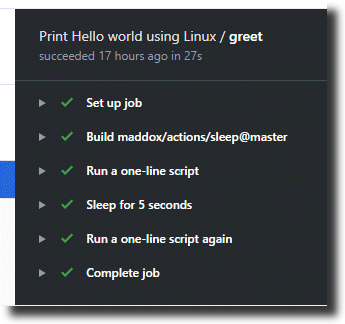

# Using GitHub Actions in a workflow

Let's shift to the next gear now. Let's create a new workflow in which we will use Linux instead of Windows and also we will see how to use actions inside a step.

- Open the `.github/workflows` folder in your repo.
- Create new file named `second_workflow.yml` and paste following code.

```yaml
name: Print Hello world using Linux

on: push

jobs:
  greet:

    runs-on: ubuntu-latest

    steps:
    - name: Run a one-line script
      run: echo Hello world!
    - name: Sleep for 5 seconds
      uses: maddox/actions/sleep@master
      with:
        args: 5
    - name: Run a one-line script again
      run: echo Hello world again after 5 seconds!

```
## Walkthrough

- This workflow is an extension of the simple workflow we created earlier. 
- The job `greet` now runs on `unbuntu` OS (line number 8). This job now has 3 steps - print hello world, wait for 5 seconds, print hello world again.
- For the first step which is `Run a one-line script`, we see that the command `echo` is being used which is same as `Write-Host` in windows. This will print `Hello world!`
- For the second step in the job which is named `Sleep for 5 seconds`, we are using an action to help us here. We could have written the code ourselves. However, one of our GitHub community members has [written an action](https://github.com/maddox/actions/tree/master/sleep) for us which will put the system in sleep for given number of seconds. 
- On line number 14, we specify which action we want to use - in this case it is `maddox/actions/sleep@master` 
- Each action accepts one or more inputs. We pass the input to an action using the keyword `with` or `env`. All this information (including how ro reference it in a workflow) will be clearly specified in the readme file associated with the action.
- In this case, we pass the input as `5` for that action - asking it to sleep for 5 seconds.
- The final step in the job is `Run a one-line script again` (line 17) which will print `Hello world again after 5 seconds!`

Click on "Commit new file" to save this workflow. Again we have pushed a file. So this workflow will start running too.

## Seeing the workflow run

Click on `Actions` tab, we will see both `Print Hello world` and `Print Hello world using Linux` running. Click on `Print Hello world using Linux`, to see the details of that workflow run.
- On the left side we see all the jobs in that workflow. In this case there is only one job named `greet`.
- That job has several steps, including the ones we defined in the workflow earlier.
- Main thing we have achieved is we are able to execute an action (piece of code not written by us) in our workflow. 
- Expanding each step, provides the details of what has happened in each step. 
- On the extreme right side of each step, we can see the time taken to execute each step. The time for `Sleep for 5 seconds` will be either 5 or a couple of seconds extra.



So with this we have seen how to consume actions in a workflow. Here we are consuming a simple action which was making the system sleep for 5 seconds. There are other actions as well which do more. 

Taking that into consideration, we have come up with 3 actions that run Office 365 CLI scripts. We will see how to use those in an SPFx project in [the next guide](./spfxworkflowwithactions.md).

At this point if needed we can take a look at the official [GitHub Actions page](https://help.github.com/en/actions/automating-your-workflow-with-github-actions) to understand them in more detail.