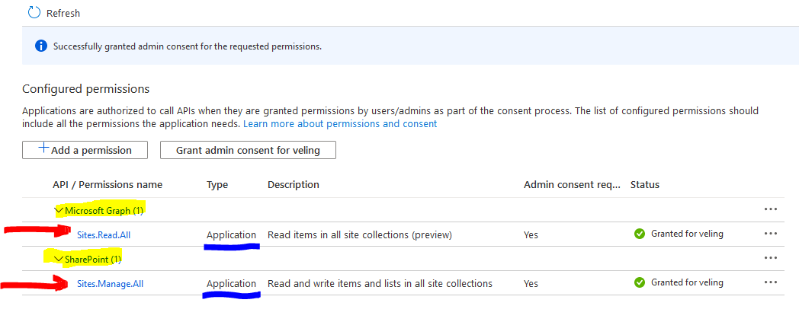

# Caveats when wroking with the CLI and certificate login

## I get error "AADSTS700027 Client assertion contains an invalid signature" when I login the CLI with certificate, what am I doing wrong?

There is an article ["Using your own Azure AD identity"](./using-own-identity.md) dedicated to using the CLI with your own identity, and you should have a look at it and see if it can help you. Many of the cases we've seen in the Github issues list are that people forget to set the `OFFICE365CLI_AADAPPID` or `OFFICE365CLI_TENANT` environment variables. Setting these variables could be as easy as adding them before your command on the bash command line like `OFFICE365CLI_AADAPPID=value1 OFFICE365CLI_TENANT=value2 o365 command` (see [#1532](https://github.com/pnp/office365-cli/issues/1532) or [#1496](https://github.com/pnp/office365-cli/issues/1496#issuecomment-625549739)). If you are Windows user the syntaxt should be like `set OFFICE365CLI_AADAPPID=value1` and `set OFFICE365CLI_TENANT=value2` then your cli command ([#1121](https://github.com/pnp/office365-cli/issues/1121#issuecomment-533609882)).

## I get "Error: AADSTS700025: Client is public so 'client_assertion' should not be presented"

If you want to authenticate the CLI using and certificate, you shouldn't treat the application as a public client. You should set the default client type your Azure AD application to "NO." More information can be found in this issue [#948](https://github.com/pnp/office365-cli/issues/948#issuecomment-487145809).

## What is the minimum set of Azure AD app permissions to execute SharePoint commands with a certificate CLI login?

When we decide to use the CLI with our Azure AD app to execute SharePoint CLI commands, it is essential to know that the CLI requires at least Microsoft Graph Sites.Read.All permissions, and then any other consents you would be required depending on the commands you'd like to execute. For example, if you'd like to list all the sites within your tenant using the `o365 spo site list` command, then the minimum permissions to your app would be Microsoft Graph `Sites.Read.All` and SharePoint `Sites.Manage.All`. 

- Your application would have the Microsoft Graph `Sites.Read.All` permissions because the o365 login command is using `https://graph.microsoft.com/v1.0/sites/root?$select=webUrl` API to dynamically find the root SharePoint site URL and use it to get a token for the SharePoint resource from Microsoft Identity dynamically.
- Your application would have the SharePoint `Sites.Manage.All` to list the sites since the CLI uses the SharePoint APIs to do that from the `spo site list` command, and the minimum permissions to list sites seem `Sites.Manage.All`.

Here is my result:

## I get an error: 403, "AccessDenied Either scp or roles claim need to be present in the token" when executing an Office 365 CLI SharePoint command. What does it mean?

It means that the Azure AD application that the CLI is running under does not have Microsoft Graph `Sites.Read.All` application permissions granted. If you are trying to use the CLI with a certificate login and SharePoint, you would have to allow Microsoft Graph `Sites.Read.All` application permissions to the Azure AD app.

## I am using CLI with a certificate, but when I execute the `spo site add` I get error "Insufficient privileges to complete the operation.".

This error can occur when you use the CLI with a certificate login and try to create a new SharePoint Team site that uses Microsoft 365 group (WebTemplate: #GROUP). Getting this error is a known issue with the CLI and the SharePoint APIs, but there is a WORKAROUND. The workaround is to use o365 aad o365group add command to create Team Sites.

If your goal is to create team sites, you can use the `o365 aad o365group add` command. The command is calling a Microsoft API that creates a Microsoft 365 group with a SharePoint site collection associated with the group. 

Here is how to do it:

As I mentioned above, when creating a Microsoft 365 Group, the Microsoft 365 APIs create a site collection with it. The mailNickname is the site URL of the site collection. You can combine the `o365 aad o365group add` with `o365 spo site set` to change additional properties of the site not available in the `o365 aad o365group add` command. From my screenshot above, you can see that I am executing the `spo site set` to change the site `--classification` after I created the group and a SharePoint site. Combining these two commands will give you the same functionality as the `spo site add` command.

### What are the minimum permissions required to use the `o365 aad o365group add` command?

You would need the Microsoft Graph `Group.Create` and `User.Read.All` application permissions.

### What are the minimum permissions required to use the `o365 aad o365group add` command and the `o365 spo site set` command?

You would need the Microsoft Graph `Group.Create` and `User.Read.All` application permissions together with SharePoint `Sites.FullControl.All` application permissions.

### Will the `spo site add` command and CLI certificate login work for creating Communication sites and Classic sites?

Yes, it will—the only troublesome site templates are the new Team sites, but the workaround above should sort that as well.

### Why not make the Team Sites being created by just executing `spo site add`?

We are discussing this with the rest of the CLI team, and we might implement a fallback to the Microsoft Graph Group APIs to create the site in case of a CLI certificate login. So, it will use the same APIs as the `aad o365group add` command uses. The CLI change might not happen overnight, so that is why I am suggesting the workaround.

### There is a well-documented API from Microsoft why the CLI does not use it to create the modern Team Sites?

There is a well-documented API for the creation of modern sites indeed. Unfortunately, the document mentions that we cannot create a new Team site based on Microsoft 365 Group.

