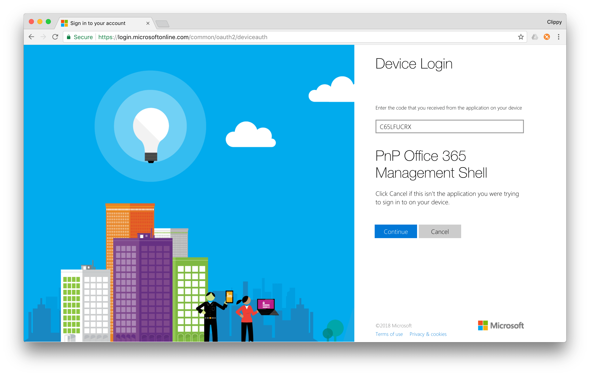

# Connecting to Office 365

Before you can use Office 365 CLI commands to manage your tenant, you have to connect to Office 365. Following section explains how you can connect and check the status of the connection to Office 365.

## Office 365 services

Using the Office 365 CLI you can manage different areas of an Office 365 tenant. Currently, commands for managing SharePoint Online and Azure Active Directory are available, but more commands for other services will be added in the future.

Commands in the Office 365 CLI are organized into services. For example, all commands that manage SharePoint Online begin with `spo` (`spo app list`, `spo cdn get`, etc.) and commands for working with the Azure AD begin with `aad`. For each Office 365 service, the CLI offers three commands for managing the connection with that service.

### Connect to an Office 365 service

To connect to an Office 365 service, use the `<service> connect` command for that service. For example, to connect to SharePoint Online, execute:

```sh
spo connect https://contoso.sharepoint.com
```

To connect to Azure AD, which uses a fixed URL, execute:

```sh
aad connect
```

!!! tip
    If the service uses a fixed URL, such as Azure AD or Microsoft Graph, you will execute the `connect` command without any arguments, for example `aad connect`. However, when connecting to other services that require a URL, such as SharePoint, you will execute the `connect` command with the URL to which the CLI should connect to, for example: `spo connect https://contoso.sharepoint.com`. For more information on connecting to each service, refer to the help of the `connect` command for that service.

After executing the `connect` command, you will be prompted to navigate to _https://aka.ms/devicelogin_ and enter the login code. After entering the code, you will see the prompt that you are about to authenticate the _PnP Office 365 Management Shell_ application to access your tenant on your behalf.

[](../images/login.png)

If you are using the Office 365 CLI for the first time, you will be also prompted to verify the permissions you are about to grant the Office 365 CLI. This is referred to as _consent_.

[](../images/consent.png)

### Check connection status

To see if you're connected to the particular Office 365 service and if so, with which account, use the `<service> status` command, for example, to see if you're connected to SharePoint Online, execute:

```sh
spo status
```

### Disconnect from an Office 365 service

To disconnect from an Office 365 service, use the `<service> disconnect` command for that service. For example, to disconnect from SharePoint Online, execute:

```sh
spo disconnect
```

!!! tip
    Each service in the Office 365 CLI manages it connection information independently. This makes it possible for you to be connected to different services with different accounts. Using the `<service> status` command you can see which account is currently connected to the particular service.

<script src="https://asciinema.org/a/158294.js" id="asciicast-158294" async></script>

### Connecting to SharePoint Online

When connecting to SharePoint Online, you can connect either to the tenant admin site (eg. `https://contoso-admin.sharepoint.com`) or any other site in your tenant. If you are connected to the tenant admin site, but would like to get information for some other site, such as the list of its subsites or lists, the CLI will automatically switch to that site, without you having to reconnect.

!!! attention
    Please note, that some commands require connection to the tenant admin site, and if you try to execute them, while being connected to a different site, you will get an error. For more information whether the connection to the tenant admin site is required or not, refer to the help of that particular command.

!!! tip
    The most convenient way of working with the CLI is to connect to the tenant admin site. Based on the options you specified when executing commands, the CLI will automatically switch between the tenant admin site or other sites that you will want to manage. You should connect to other sites only, if you don't have tenant admin privileges and yet would like to automate some of your work using the Office 365 CLI.

## Authorize with Office 365

To authorize for communicating with Office 365 API, the Office 365 CLI uses Azure AD OAuth 2.0 device flow. After executing the `connect` command for the particular service, the CLI will initiate the authorization flow. In the terminal, you will see the device code that you have to enter at _https://aka.ms/devicelogin_ which will complete the authorization flow and grant the CLI access to communicate with Office 365 on your behalf.

## Connecting to Office 365 via a proxy

All communication between the Office 365 CLI and Office 365 APIs happens via web requests. If you're behind a proxy, you should set up an environment variable to allow Office 365 CLI to connect to Office 365. More information about the necessary configuration steps is available at [https://github.com/request/request#controlling-proxy-behaviour-using-environment-variables](https://github.com/request/request#controlling-proxy-behaviour-using-environment-variables).

## Persisted connections

After connecting to Office 365, the Office 365 CLI will persist that connection information until you explicitly disconnect from the particular service. This is necessary to support building scripts using the Office 365 CLI, where each command is executed independently of other commands. Persisted connection contains information about the user name used to establish the connection, the connected Office 365 service URL, the access token and the refresh token. To secure this information from unprivileged access, it's stored securely in the password store specific to the platform on which you're using the CLI. For more information, see the separate article dedicated to [persisting connection information](../concepts/persisting-connection.md) in the Office 365 CLI.